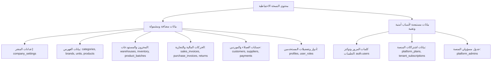
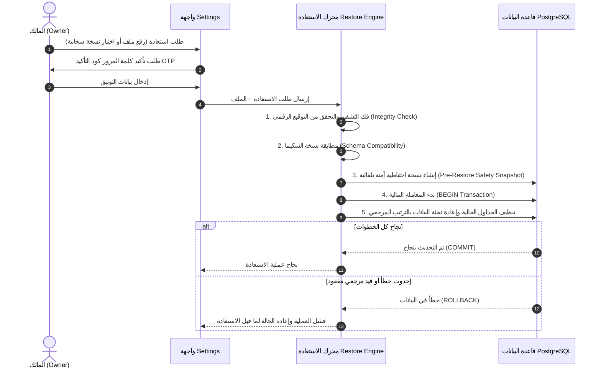
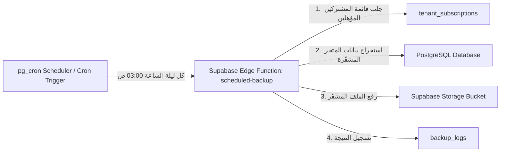

# خطة إعداد ونظام النسخ الاحتياطي والمزامنة الآمنة — فورتيكس ERP (Market Hub)

> **إخلاء مسؤولية وتننويه:** هذه الوثيقة مخصصة للتخطيط والتصميم الهيكلي الفني فقط. لم يتم إجراء أي تعديل على قاعدة البيانات، أو الكود البرمجي، أو الإعدادات الحالية أثناء إعداد هذه الخطة.

---

## 1. الهدف من نظام النسخ الاحتياطي (Backup System Goals)

يقوم نظام النسخ الاحتياطي في منصة **Market Hub / Vortex ERP** على تحقيق الأهداف الرئيسية التالية:

1. **حماية البيانات التشغيلية والمالية:** منع فقدان البيانات الناتجة عن أخطاء العنصر البشري، أو الأعطال التقنية، أو الانقطاعات الكارثية.
2. **الاستعادة الفورية والموثوقة (Point-in-Time Restore):** تمكين المالك (Owner) من إعادة المتجر إلى حالة سابقة آمنة ومضمونة التناسق دون ضرب العلاقات المرجعية بين الجداول.
3. **الاستقلالية والتخزين المزدوج:** توفير مرونة الاختيار بين النسخ المحلي المباشر (على جهاز المستخدم) والنسخ السحابي المؤتمت (على Supabase Storage).
4. **التوافق التام مع بنية النظام الحالية:** استخدام البنية المعمارية المتوفرة حالياً في مشروع Supabase (PostgreSQL, RLS, Edge Functions) بدون إدخال تعقيدات خارج نطاق المشروع.

---

## 2. أنواع النسخ الاحتياطي (Backup Types)

| ميزة المقارنة | النسخة الاحتياطية المحلية (Local Backup) | النسخة الاحتياطية السحابية (Cloud Backup) |
| :--- | :--- | :--- |
| **مكان الحفظ** | جهاز المستخدم (الملفات المحلية / التنزيلات) | Supabase Storage Bucket المخصص للشركة |
| **درجة الأوتوماتيكية** | تنزل بطلب يدوّي أو حفظ عبر المتصفح | آلية بالكامل وفق جدول محدد (يومي/أسبوعي) |
| **الاعتمادية** | تعتمد على وجود المستخدم والجهاز المحلي | مستقلة تماماً وتعمل في الخلفية السحابية (24/7) |
| **طريقة التشفير** | تشفير Client-side أو Server-side بنفس الملف (`.vortexbak`) | تشفير AES-256-GCM قبل الحفظ في السحابة |
| **طريقة الاستعادة** | رفع الملف المشفّر من جهاز المستخدم إلى الواجهة | اختيار النسخة المطلوبة مباشرة من قائمة النسخ السحابية |
| **الاستخدام الأمثل** | الاحتفاظ بنسخة فورية سرية في يد المالك قبل أي تغييرات | الحماية المستمرة ضد الكوارث والأخطاء دون تدخل يدوي |

---

## 3. إعدادات المستخدم والواجهة المقترحة (Settings UI Proposal)

سيتم إضافة بطاقة اختصاصية جديدة داخل صفحة الإعدادات الحالية [`src/routes/_app.settings.tsx`](file:///c:/Users/ahmed/Desktop/market-hub/src/routes/_app.settings.tsx) باسم **"إدارة النسخ الاحتياطي والأمان" (Backup & Data Protection)**.

### المكونات والخيارات المتاحة للمستخدم:

1. **تفعيل/تعطيل النسخ التلقائي (Auto Backup Switch):** زر تفعيل للنسخ المجدول.
2. **نوع التخزين المفضل (Storage Destination):**
   - محلي فقط (Local Only)
   - سحابي فقط (Cloud Only)
   - مزدوج (محلي + سحابي)
3. **تكرار الجدولة (Schedule Frequency):**
   - يومي (Daily)
   - أسبوعي (Weekly)
4. **وقت التنفيذ (Execution Time Window):** تحديد الساعة المفضل تنفيذ النسخ فيها (مثال: `03:00 AM` لضمان عدم توفر حركة POS).
5. **سياسة الاحتفاظ (Retention Limit):** اختيار عدد النسخ المحتفظ بها بسحابة المتجر (أحدث 7 نسخ / 15 نسخة / 30 نسخة)، حيث يتم حذف النسخ القديمة تلقائياً.
6. **بطاقة حالة آخر نسخة (Last Backup Status Card):**
   - تاريخ ووقت آخر عملية.
   - الحجم الإجمالي للنسخة.
   - نوع النسخة (محلي / سحابي).
   - مؤشر حالة النجاح / الفشل (Success/Failure Badge).
7. **زر إنشاء نسخة فورية (Manual Backup Button):** زر يتيح للمالك تشغيل عملية نسخ فورية في أي وقت مع مؤشر تقدم (Progress Bar).
8. **قسم الاستعادة الآمنة (Safe Restore Dialog):**
   - نافذة مؤمنة تتطلب إعادة إدخال كلمة المرور أو رمز التأكيد OTP قبل البدء.
   - إمكانية تحديد ملف محلي أو اختيار نسخة سحابية تاريخية.

---

## 4. التخزين المحلي (Local Storage Architecture)

### التحديات والقيود:
1. `localStorage` المتصفح محدود بـ 5MB إلى 10MB فقط، وهو غير صالح لتخزين قواعد بيانات ERP تحتوي على مئات الفواتير والمنتجات.
2. مسح ملفات الكوكيز والـ Cache من المتصفح يؤدي إلى حذف التخزين الداخلي فوراً.

### الحل العملي المعتمد للبنية الحالية:
* **التصدير المباشر المشفّر (Direct Encrypted Export):**
  - عند طلب النسخة المحلية، يقوم المحرك بإنشاء ملف بصيغة `.vortexbak` مشفّر يضم كافة سجلات الداتا بصيغة JSON مضغوطة.
  - يتم تشغيل تنزيل آلي (Download Trigger) في المتصفح يحفظ الملف في مجلد `Downloads` أو المجلد الذي يحدده المستخدم.
* **دعم File System Access API:**
  - في المتصفحات الحديثة، سيتم إتاحة اختيار مجلد ثابت على جهاز المستخدم (مثل `D:/Backups/VortexERP`) ليتم حفظ الملفات فيه مباشرة بضغط زر واحدة.

---

## 5. التخزين السحابي (Cloud Storage Specification)

### 1. مكان التخزين (Storage Bucket)
* إنشاء **Supabase Storage Bucket** جديد باسم: `tenant-backups`.
* ضبط إعدادات الـ Bucket لتكون **Private** (تمنع الوصول العام المباشر عبر روابط URL).

### 2. التنظيم والتسمية (Folder Hierarchy)
تُنظم النسخ داخل الـ Bucket بالشكل التالي لتسهيل الإدارة وتفادي التداخل:
```text
tenant-backups/
├── {tenant_id}/
│   ├── 2026/
│   │   ├── 09/
│   │   │   ├── backup_auto_20260928_030000_v1.vortexbak
│   │   │   └── backup_manual_20260928_143000_v1.vortexbak
```

### 3. التشفير والحماية
* تشفير محتوى الملف قبل الرفع أو أثناء المعالجة باستخدام **AES-256-GCM** مع مفتاح تشفير ديناميكي يتم إنتاجه وحفظه بأمان في بيئة النظام (Environment Secrets).

### 4. صلاحيات الوصول و RLS على مستوى Storage
* إضافة سياسات Storage Policies تقتصر على:
  - السماح للقراءة والتنزيل فقط للمستخدمين الحاملين لدور `owner` التابعين لنفس الـ `tenant_id`.
  - السماح لـ `service_role` (الذي تستخدمه الـ Edge Functions) بالرفع والحذف وفق سياسة الاحتفاظ.

---

## 6. محتوى النسخة الاحتياطية (Backup Data Boundaries)

تحديد الجداول التي يجب شملها أو استبعادها لضمان سلامة الأمان والتكامل المرجعي:



### الجداول المشمولة بالتفصيل (Included Tables):
1. **الإعدادات والمستودعات:** `company_settings`, `warehouses`.
2. **الفهرس والمنتجات:** `categories`, `brands`, `units`, `products`, `product_batches`, `inventory`.
3. **الأطراف والذمم:** `customers`, `suppliers`, `customer_payments`, `customer_payment_splits`, `loyalty_transactions`.
4. **المبيعات والمشتريات والمرتجعات:** `sales_invoices`, `sales_invoice_items`, `sales_returns`, `sales_return_items`, `purchase_invoices`, `purchase_invoice_items`, `purchase_returns`, `purchase_return_items`.
5. **المخزون والمناقلات والمصروفات:** `stock_movements`, `stock_transfers`, `stock_transfer_items`, `expenses`, `expense_categories`.
6. **الهيكل الإداري الداخلي للمتجر:** `profiles`, `user_roles`.

### الجداول والبيانات المستبعدة (Excluded Data):
1. **بيانات المصادقة الحساسة (`auth.users`):** لا يتم نسختها لمنع تسريب أرقام السر وتوكنات الحسابات.
2. **بيانات باقات واشتراكات المنصة (`platform_plans`, `tenant_subscriptions`, `platform_modules`):** تدار حصرياً من قبل مدير المنصة لضمان عدم تلاعب المستخدم بباقته عبر رفع نسخة احتياطية معدلة.
3. **سجل التدقيق الحركي (`audit_logs`):** يُفضل عدم تضمينه لتقليل حجم النسخة وتجنب تكرار الأحداث، مع البدء بسجل جديد بعد الاستعادة.

---

## 7. خطة الاستعادة (Safe Restore Protocol)

تعتبر عملية الاستعادة (Restore) العملية الأكثر خطورة، لذا تتضمن الخطة ضوابط صارمة:



### خطط الحماية أثناء الاستعادة:
- **التحقق من السلامة المرجعية (Foreign Keys Order):** يتم إدخال البيانات بالترتيب الصحيح (مثلاً: الفئات -> المنتجات -> المستودعات -> الفواتير -> عناصر الفواتير) لمنع إخفاق قيود Foreign Key.
- **نسخة السلامة المسبقة (Safety Snapshot):** قبل مسح أو كتابة أي بيانات، يتم أخذ نسخة سحابية مؤقتة تلقائياً لضمان العودة إليها في حال رغب المستخدم بإلغاء الاستعادة.

---

## 8. الأمان وتشفير البيانات (Security & Permissions)

1. **تشفير الملفات:** يتم تشفير جميع ملفات النسخ الاحتياطي بواسطة **AES-256-GCM** لمنع قراءة البيانات أو تعديلها خارج النظام.
2. **التحقق من التكامل (HMAC Signature):** يتم إرفاق توقيع رقمي هاش (SHA-256 HMAC) داخل الملف المشفّر؛ وإذا تم تغيير أي بيت في الملف يدوياً، ترفض عملية الاستعادة فوراً.
3. **سياسات RLS والتأكد من الصلاحيات:**
   - يقتصر حق إنشاء أو استعادة أو تنزيل النسخ الاحتياطية على الدور القيادي `owner` والدور المتفوق `platform_superadmin`.
   - يمنع دور `cashier` و `accountant` و `warehouse` و `manager` من الوصول لأدوات الاستعادة الكلية.
4. **منع تسريب البيانات بين المستأجرين (Tenant Isolation):** قيد كافة الاستعلامات بـ `tenant_id` لمنع تداخل نسخ المتاجر المختلفة.

---

## 9. الخطط والصلاحيات (Plans & Subscriptions Compatibility)

استناداً إلى جدول الباقات الحالي المعرّف في المشروع ([`supabase/migrations/20260915000000_platform_modules_and_subscriptions.sql`](file:///c:/Users/ahmed/Desktop/market-hub/supabase/migrations/20260915000000_platform_modules_and_subscriptions.sql)):

| الميزة | الباقة الأساسية (`starter`) | الباقة الاحترافية (`professional`) | باقة المؤسسات (`enterprise`) |
| :--- | :--- | :--- | :--- |
| **النسخ الاحتياطي المحلي اليدوي** | متاح | متاح | متاح |
| **النسخ الاحتياطي السحابي اليدوي** | غير متاح | متاح | متاح |
| **الجدولة السحابية الآلية** | غير متاح | أسبوعي | يومي + أسبوعي |
| **سياسة الاحتفاظ (Retention)** | أحدث 3 نسخ | أحدث 10 نسخ | أحدث 30 نسخة |
| **الاستعادة الفورية بضغطة زر** | عبر رفع الملف محلياً | محلي + سحابي | محلي + سحابي + استعادة تاريخية |

---

## 10. السجل والمراقبة (Backup Audit Log)

سيتم إنشاء جدول مخصص باسم `backup_logs` لتتبع كافة العمليات:

### حقول الجدول المقترحة:
- `id`: المعرف الفريد UUID.
- `tenant_id`: معرف المتجر.
- `actor_id`: ID المستخدم الذي قام بالعملية.
- `action_type`: نوع الحركة (`backup_manual`, `backup_auto`, `restore_manual`).
- `storage_type`: مكان التخزين (`local`, `cloud`).
- `status`: حالة العملية (`success`, `failed`, `in_progress`).
- `file_name`: اسم الملف.
- `file_size_bytes`: حجم الملف بالبايت.
- `error_message`: تفاصيل الخطأ في حال الفشل.
- `created_at`: تاريخ ووقت التنفيذ.

---

## 11. الجدولة التلقائية (Background Scheduling Architecture)

ضمان تنفيذ النسخ الاحتياطي اليومي والأسبوعي دون الاعتماد على بقاء متصفح المستخدم مفتوحاً:



### المكونات المستهدفة للجدولة:
1. **Supabase Edge Function (`scheduled-backup`):** تعمل كبيئة خادمة مستقلة (Deno / TypeScript).
2. **مُشغّل الجدولة (Cron Trigger):** يتم ربط الـ Edge Function بواسطة `pg_cron` داخل قاعدة البيانات أو عبر خادم جدولة آمن (مثل Supabase Scheduled Functions / GitHub Actions Webhook) لتنفيذ العمليات في الأوقات المنخفضة الحركة.

---

## 12. تصور واجهة المستخدم (Settings UI Specification)

تصميم واجهة متناسقة مع الهوية الحالية للنظام (Vortex ERP UI) باللغة العربية ودعم اتجاه RTL:

```text
+-----------------------------------------------------------------------------------+
|  إدارة النسخ الاحتياطي وحماية البيانات                                           |
|  قم بتأمين بيانات المتجر والفواتير، وإعداد الجدولة الآلية للنسخ السحابي           |
+-----------------------------------------------------------------------------------+
|                                                                                   |
|  [ بطاقة إعدادات الجدولة والتخزين ]                                                |
|  - تفعيل النسخ التلقائي:  ( ON / OFF )                                            |
|  - نوع التخزين المفضل:     ( محلي | سحابي | مزدوج )                              |
|  - التكرار المجدول:       ( يومي | أسبوعي )                                       |
|  - وقت التنفيذ المفضّل:     [ 03:00 AM  v ]                                         |
|  - عدد النسخ المحتفظ بها:  [ 15 نسخة   v ]                                         |
|  [ حفظ إعدادات الجدولة ]                                                          |
|                                                                                   |
+-----------------------------------------------------------------------------------+
|                                                                                   |
|  [ حالة آخر نسخة احتياطية ]                                                        |
|  الحالة: [ ناجحة  ✓ ]     النوع: سحابي مجدول      التاريخ: 2026-09-28 03:00 AM       |
|  الحجم: 4.2 MB           اسم الملف: backup_auto_20260928_030000.vortexbak          |
|                                                                                   |
|  [ ⚡ إنشاء نسخة احتياطية فورية الآن ]        [ 📥 استعادة نسخة سابقة ]           |
|                                                                                   |
+-----------------------------------------------------------------------------------+
|                                                                                   |
|  [ سجل حركات النسخ والاستعادة السابقة ]                                           |
|  -------------------------------------------------------------------------------  |
|  التاريخ         | المعالج        | النوع   | الحجم  | الحالة  | الإجراءات         |
|  -------------------------------------------------------------------------------  |
|  2026-09-28 03:00| النظام (آلي)   | سحابي  | 4.2 MB | ناجحة   | [تحميل] [استعادة]|
|  2026-09-27 15:40| أحمد (المالك)  | محلي   | 4.1 MB | ناجحة   | [تنزيل]           |
+-----------------------------------------------------------------------------------+
```

---

## 13. الأداء والتعامل مع قواعد البيانات الكبيرة (Performance Plan)

1. **الاستعلام الدفعي (Paginated Chunking):** عدم جلب كافة السجلات دفعة واحدة في الذاكرة (Memory Stack Overshoot)، بل جلب البيانات على دفعات (Batches of 1000 rows).
2. **الضغط الفوري (Streaming Compression):** ضغط البيانات أثناء استخراجها لتخفيض حجم الملف بنسبة تصل إلى 70%.
3. **عدم التأثير على الكاشير و POS:** تشغيل دوال النسخ الاحتياطي عبر الاستعلامات غير الكاتبة (Read-Only Selects) وبمستوى أولوية منخفض لمنع حجز القفل (Table Locking) على جداول المبيعات والمخزون أثناء عمليات البيع اللحظية.

---

## 14. خطة التنفيذ الموزعة على مراحل (Implementation Roadmap)

عند الموافقة على هذه الخطة، سيتم تنفيذ العمل وفق المراحل الـ 7 التالية بشكل متسلسل:

```mermaid
gantt
    title مراحل تنفيذ نظام النسخ الاحتياطي
    dateFormat  YYYY-MM-DD
    section التأسيس
    المرحلة 1: قواع البيانات و Storage       :active, m1, 2026-10-01, 2d
    section المحرك الأساسي
    المرحلة 2: محرك النسخ والتشفير           :m2, after m1, 3d
    المرحلة 3: Edge Functions والجدولة       :m3, after m2, 2d
    section الاستعادة والواجهة
    المرحلة 4: محرك الاستعادة والمعاملات    :m4, after m3, 3d
    المرحلة 5: واجهة الإعدادات والـ UI        :m5, after m4, 2d
    section الأمان والاختبار
    المرحلة 6: الصلاحيات و RLS                :m6, after m5, 1d
    المرحلة 7: الاختبارات الشاملة             :m7, after m6, 2d
```

1. **المرحلة 1 (Database & Storage Structure):** إنشاء جدول `backup_logs` و Bucket التخزين `tenant-backups` وإعداد سياسات RLS.
2. **المرحلة 2 (Backup Core Engine):** بناء دوال التشفير AES-256 والتجميع واستخراج البيانات برمجياً.
3. **المرحلة 3 (Scheduling & Edge Functions):** إنشاء وترقية Supabase Edge Function وتفعيل التكرار المجدول.
4. **المرحلة 4 (Restore Engine & Integrity):** بناء ميكانيكية الاستعادة الآمنة مع المعاملات المالية (Transactions & Safety Snapshots).
5. **المرحلة 5 (Settings UI Component):** تطوير المكون `BackupSettingsCard` وتكمله داخل صفحة `/_app/settings.tsx`.
6. **المرحلة 6 (Permissions & RLS Hardening):** تقييد الصلاحيات وحظر الوصول لغير المالك والمدير الفائق.
7. **المرحلة 7 (End-to-End Testing):** تجربة كافة سيناريوهات النسخ والاستعادة والتحقق من سلامة البيانات.

---

## 15. حالات الاختبار الشاملة (Test Cases Plan)

| # | حالة الاختبار | النتيجة المتوقعة |
| :--- | :--- | :--- |
| **TC-01** | إنشاء نسخة احتياطية محلية | تنزيل ملف `.vortexbak` مشفّر يحتوي كافة بيانات المتجر |
| **TC-02** | رفع نسختها السحابية يدويًا | استقرار الملف في Supabase Storage مع تسجيل السجل كـ `success` |
| **TC-03** | استعادة نسخة صحيحة | استرجاع البيانات الفعلي وتحديث الشاشات بنجاح |
| **TC-04** | استعادة ملف تالف أو معدل | رفض الاستعادة فوراً بفضل التوقيع الرقمي (HMAC Check Failure) |
| **TC-05** | محاولة استعادة بواسطة دور `cashier` | منع المستخدم وإظهار رسالة رفض الصلاحية |
| **TC-06** | تشغيل النسخ المجدول آلياً | نجاح دالة Edge Function وتسجيل الحركة في `backup_logs` |
| **TC-07** | محاولة الوصول لنسخة متجر آخر | منع RLS للمستخدم من تنزيل أو قراءة أي ملف خارج متجره |

---

## 16. المخاطر المحتملة والحلول المقترحة (Risks & Mitigations)

1. **المخاطرة: انقطاع عملية الاستعادة في المنتصف وترك قاعدة البيانات في حالة غير مستقرة.**
   - **الحل:** تنفيذ العملية بالكامل داخل **PostgreSQL Transaction** منفردة تعود للحالة الأصلية (Rollback) في حال حدث خطأ بآخر جزء، مع وجود **Safety Snapshot** مسبق.
2. **المخاطرة: تضخم حجم الملفات وتجاوز مساحة التخزين المتاحة.**
   - **الحل:** تفعيل سياسة الحذف التلقائي للنسخ القديمة (Retention Policy) والتأكد من ضغط الملفات.
3. **المخاطرة: محاولة تلاعب بالنسخة الاحتياطية لترقية الباقة مجاناً.**
   - **الحل:** استبعاد جداول الباقات والاشتراكات (`tenant_subscriptions`, `platform_plans`) من التصدير والاستعادة تماماً.

---

## 17. خريطة الملفات والمكونات المتوقع تعديلها مستقبلاً (Expected Files Roadmap)

> **تنبيه:** هذه القائمة تمثل الملفات التي سيتم إنشاؤها أو تعديلها لاحقاً **بعد الموافقة على هذه الخطة**، ولم يتم اللمس أو التعديل عليها في هذه المرحلة:

### ملفات ستم إنشاؤها لاحقاً (New Files):
- `supabase/migrations/20260929000000_backup_system_tables.sql`
- `supabase/functions/scheduled-backup/index.ts`
- `src/components/backup-settings-card.tsx`
- `src/components/backup-restore-dialog.tsx`
- `src/lib/backup/backup-engine.ts`
- `src/lib/backup/crypto-utils.ts`

### ملفات متوقع تعديلها لاحقاً (Files to Update):
- [`src/routes/_app.settings.tsx`](file:///c:/Users/ahmed/Desktop/market-hub/src/routes/_app.settings.tsx) (تضمين بطاقة إعدادات النسخ الاحتياطي).
- [`src/integrations/supabase/types.ts`](file:///c:/Users/ahmed/Desktop/market-hub/src/integrations/supabase/types.ts) (تحديث الأنواع بعد إضافة جدول `backup_logs`).
