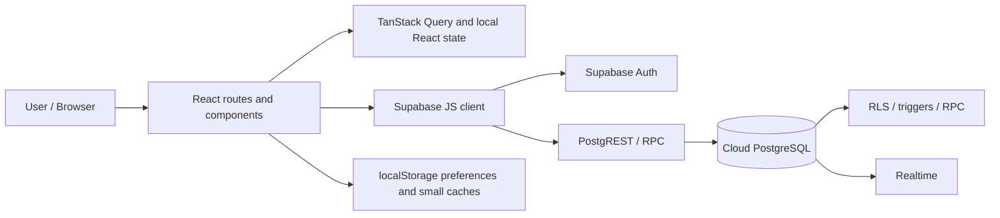
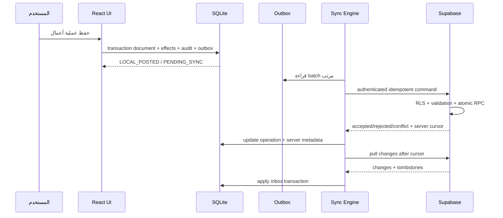
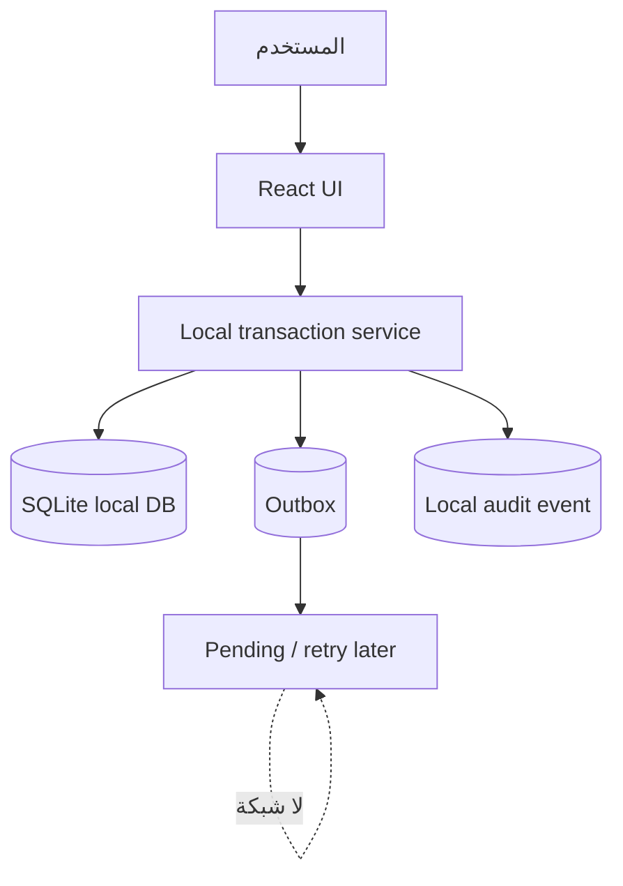
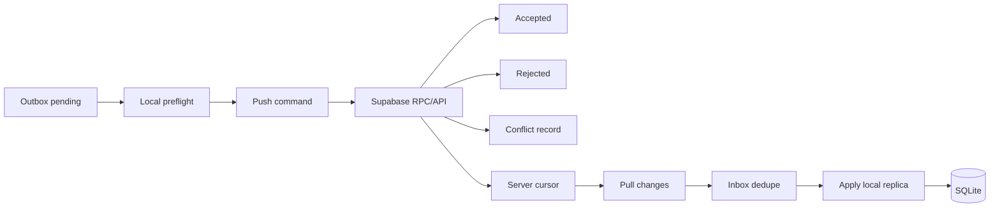
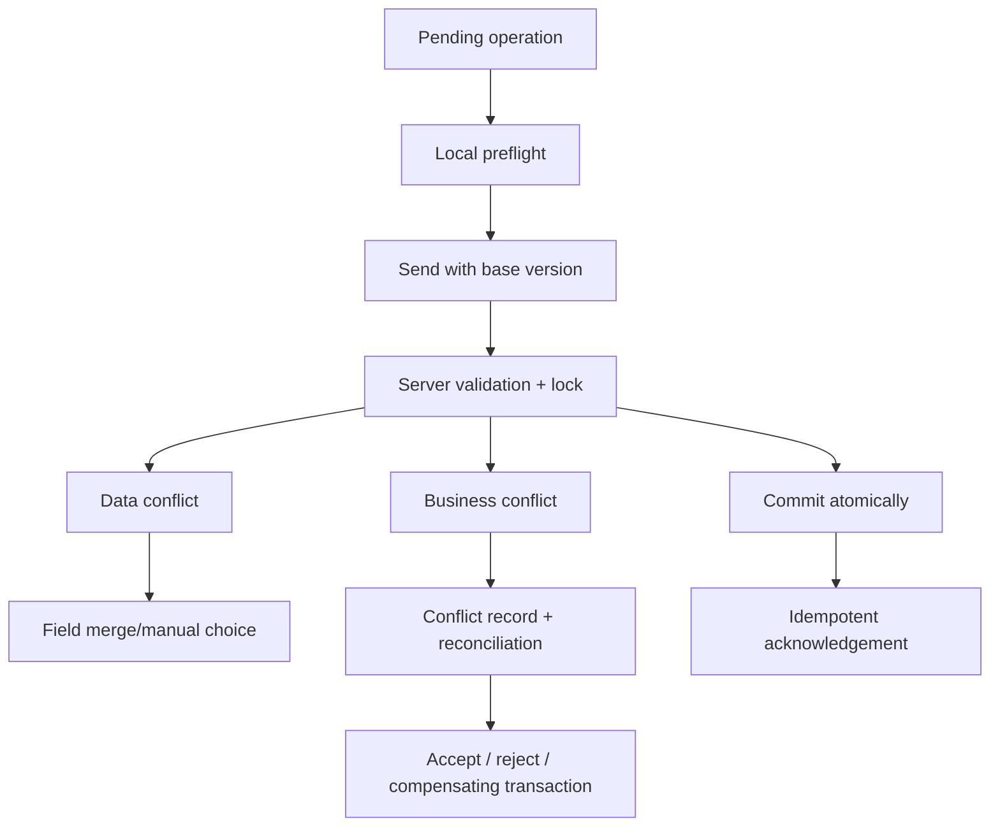
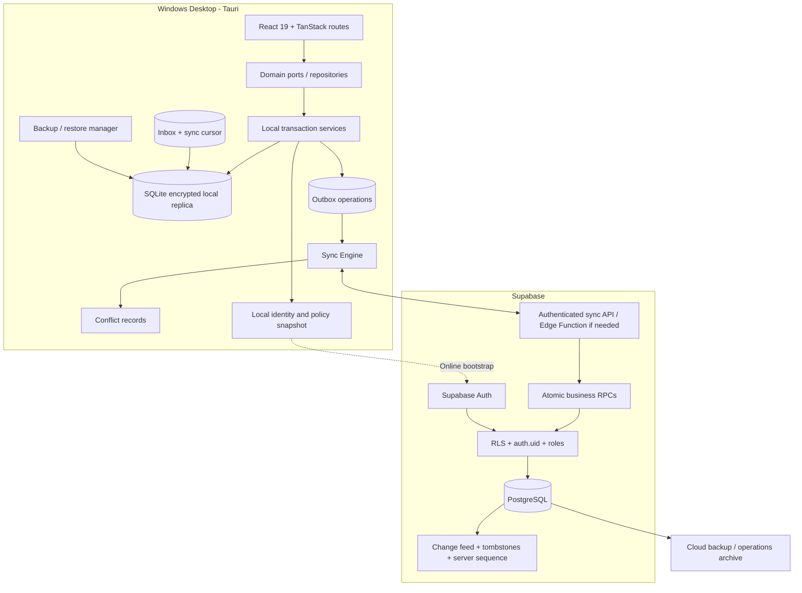

# دراسة معمارية التحويل إلى ERP يعمل Offline-First

**المشروع:** Market Hub / Vortex ERP  
**المستودع:** `mosaa65/market-hub`  
**نقطة الدراسة:** الفرع `main` عند commit `b602181866e74eb2877deb88eb7283fd9cbccc79`  
**نوع المستند:** دراسة وتحليل وخطة مستقبلية فقط — لا يحتوي هذا الفرع على Implementation  
**الفرع المستهدف:** `yunis-offline-architecture`  
**تاريخ الدراسة:** 2026-09-30

> هذه الوثيقة لا تنفذ أي تغيير في التطبيق أو قاعدة البيانات أو Supabase. كل أسماء الملفات والـtables والـRPCs الواردة هنا هي خريطة للتغيير المستقبلي، وليست أوامر تنفيذ.

---

## 1. الملخص التنفيذي

### القرار المعماري

التوصية الوحيدة القابلة للاعتماد لـ Vortex ERP هي:

> **تطبيق Windows Desktop مبني على Tauri، يحتفظ بنسخة محلية معاملاتية في SQLite مشفّرة/محميّة، ويستخدم طبقة Domain/Data Access موحّدة، مع Sync Engine يعتمد على Outbox وInbox وعمليات idempotent وserver-side validation، ويتصل بـ Supabase عبر API/RPC مخصص للمزامنة.**

الصورة المنطقية:

```text
Windows Desktop (Tauri)
├── React + TanStack UI
├── Domain / Transaction Services
├── SQLite local replica
│   ├── business tables
│   ├── outbox
│   ├── inbox
│   ├── sync_state
│   ├── conflict_records
│   └── audit_events
└── Sync Engine
    ├── push pending operations
    ├── pull server changes
    ├── retry / backoff
    ├── idempotency
    └── reconciliation
             │
             ▼
      Supabase PostgreSQL + Auth + RLS + RPC
```

هذه ليست توصية بأن يصبح SQLite نسخة مصغرة من PostgreSQL بلا ضوابط، وليست توصية بكتابة SQL محلي عشوائي. SQLite هو التخزين المحلي، أما سلامة العملية التجارية فتُعرّف في طبقة معاملات مشتركة وتُنفذ على الخادم عبر RPCs ذرية عند المزامنة. العملية المحلية تُقبل فورًا فقط عندما تستطيع السياسة المحلية تطبيق كل قيودها، ثم تبقى Pending إلى أن يعتمدها الخادم.

### ما يثبته التدقيق الحالي

- المشروع تطبيق React 19 / TypeScript / TanStack Start وTanStack Router، مع Supabase JavaScript client وPostgreSQL RPC وRLS.
- توجد 229 ملفات مصدر تقريبًا، و54 migration، و32 ملف تعريف RPC، و453 عنصرًا متتبعًا في شجرة المستودع عند التدقيق.
- `src` يعتمد Supabase مباشرة في عدد كبير من المسارات، ولا توجد طبقة Repository/Port موحدة تفصل الواجهة عن مصدر البيانات.
- TanStack Query يدير حالة في الذاكرة؛ لا توجد آلية persisted query cache تجعل بيانات ERP أو المعاملات قابلة للاستمرار بعد إغلاق التطبيق.
- `networkMode: "online"` في إعدادات الاستخدام الحالية يمنع اعتبار React Query محرك Offline.
- `localStorage` يستخدم للتفضيلات وبعض الإعدادات/الكاش، وليس قاعدة بيانات معاملاتية.
- توجد RPCs جيدة للمبيعات والمشتريات والمرتجعات والتحويلات والدفعات وبعض محركات المخزون الحديثة، لكن توجد أيضًا عمليات CRUD مباشرة ومسارات تكتب `inventory` أو `stock_movements` مباشرة.
- migration حديثة أنشأت `post_stock_delta` كمبدأ موحد لكتابة المخزون، وأصبح `inventory` للقراءة فقط للمستخدم العادي في ذلك التصميم؛ هذا اتجاه صحيح يجب الحفاظ عليه.
- Supabase Auth وRLS مصممان لجلسة واتصال سحابيين؛ لا يمكن افتراض أن Supabase Auth وحده يحقق تسجيل الدخول غير المحدود Offline.
- توجد Edge Functions تستخدم سرًا إداريًا في الخادم، منها `admin-create-user`، وهذا السر يجب أن يبقى خارج التطبيق المثبت تمامًا.
- السلسلة الحالية للـmigrations تحتوي تاريخيًا على reset/seed/auth bootstrap ومشكلات تشغيلية موثقة. لا ينبغي أن تكون آلية Initial Sync المستقبلية هي إعادة تشغيل هذه السلسلة على جهاز العميل.

### ما لا يمكن الوعد به

1. **عدم وجود تعارضات مخزون أو مالية بنسبة 100% أثناء Offline** إذا وُجد مصدر آخر يبيع أو يعدّل نفس المخزون في السحابة. يمكن منع فقدان العملية، واكتشاف التعارض، ورفض أو تسوية العملية؛ لا يمكن جعل رصيدين متعارضين صحيحين معًا بلا سياسة أعمال.
2. **حماية Source Code حماية مطلقة** من مالك Windows لديه Administrator. يمكن رفع تكلفة الاستخراج وحماية الأسرار والبيانات، لكن لا يمكن منع مستخدم يملك الجهاز من تحليل binary أو تعديل client.
3. **RLS السحابية لا تحمي SQLite تلقائيًا.** يجب تطبيق صلاحيات محلية، وتشفير/حماية الملف، وقيود على العمليات، ثم إعادة التحقق في Supabase.
4. **Offline غير محدود** يعني أن البيانات قديمة وأن المخاطر التشغيلية تتراكم. إذا كان المقصود عدم فرض انتهاء الترخيص أو revalidation، فهذا ممكن تقنيًا، لكن سياسات الأمان والتضارب لا تختفي.

### أولويات النجاح

1. عدم فقدان أو تكرار أي عملية بيع أو شراء أو مرتجع أو دفع.
2. عدم إخفاء اختلاف المخزون أو تسويته بـ Last Write Wins.
3. جعل كل شاشة تعتمد على `Local Data Access` بدل استدعاء Supabase مباشرة.
4. جعل كل عملية قابلة لإعادة المحاولة بعد crash أو انقطاع الشبكة.
5. بناء Cloud Sync تدريجيًا بعد إثبات صحة العمليات محليًا.
6. دعم جهاز Windows واحد في النسخة الأولى، مع عدم إغلاق باب multi-device مستقبلًا.

---

## 2. نطاق الدراسة ومنهجها

تمت قراءة الشيفرة والمخطط والـmigrations والـRPCs والـRLS والملفات التوثيقية، وليس README فقط. شمل التدقيق:

- `src/routes`
- `src/components`
- `src/hooks`
- `src/lib`
- `src/integrations/supabase`
- `supabase/migrations`
- `supabase/functions`
- `supabase/seeds`
- `supabase/config.toml`
- تقارير قاعدة البيانات والأمن والخطط الموجودة في `docs`

### حدود الأدلة

هذه دراسة repository-level. لم تُجرَ تعديلات على التطبيق أو SQL أو Supabase كجزء من هذه المهمة. أي حالة تعتمد على بيانات الإنتاج الفعلية، مثل عدد الصفوف أو وجود orphan rows، تحتاج استعلامًا منفصلًا وآمنًا في بيئة العميل. بعض الوثائق الموجودة تعكس مراحل مختلفة من المشروع؛ لذلك أُعطي الأولوية للكود والـmigration الأحدث، ثم أُذكر التناقضات صراحة بدل افتراض أنها حقائق تشغيلية.

---

## 3. متطلبات العمل والقيود

### المتطلبات الثابتة

| المتطلب | القرار/الأثر المعماري |
|---|---|
| Windows قابل للتثبيت | نحتاج Desktop shell وinstaller ونسخة بيانات مستقلة عن مجلد البرنامج |
| جهاز واحد لكل عميل حاليًا | لا نحتاج distributed multi-writer في Phase 1، لكن يجب حفظ operation IDs وversions |
| كل النظام Offline، لا POS فقط | يجب تخزين master data والتقارير والعمليات محليًا |
| استخدام Offline غير محدود زمنيًا | لا نعتمد على online revalidation كشرط تشغيل؛ نوضح التنازلات |
| مزامنة تلقائية عند عودة الاتصال | نحتاج push/pull durable مع retry وcursor |
| Supabase حاليًا | نعيد استخدام PostgreSQL وRLS وRPC حيث يناسب، مع إضافة sync contract |
| سلامة المخزون والمالية | لا LWW للـledger أو الرصيد أو الحركات؛ نستخدم عمليات append-only ورفض/تسوية |
| حماية الأسرار | لا service-role key ولا database password في Desktop client |
| عدم تنفيذ الآن | هذا المستند فقط؛ أي تغييرات لاحقة مرحلة مستقلة بعد موافقة صريحة |

### الفرق بين خمسة أشياء يختلط اسمها

| المصطلح | ما يقدمه | لماذا لا يكفي وحده |
|---|---|---|
| Cache | نسخة مؤقتة يمكن حذفها وإعادة جلبها | لا يضمن بقاء البيانات ولا حفظ عملية تمت Offline |
| Local persistence | تخزين يبقى بعد إغلاق التطبيق | قد يكون بلا علاقات أو transaction أو outbox |
| Local database | استعلامات وعلاقات وقيود ومعاملات محلية | لا تعني وجود مزامنة أو حل تعارض |
| Offline transactional system | عملية الأعمال والـstock/financial effects تُحفظ ذرّيًا بلا اتصال | يحتاج سياسة قبول لاحقًا، لا مجرد تخزين rows |
| Bidirectional sync | نقل تغييرات محلية وسحابية في الاتجاهين مع cursor/idempotency | يحتاج protocol وschema وconflict records، لا Realtime وحده |

**النتيجة:** المطلوب هو آخر مستويين معًا. Cache أو localStorage أو persisted query cache قد تكون أدوات مساعدة، لكنها ليست الحل.

---

## 4. تدقيق المعمارية الحالية

### الشكل الحالي



### نقاط القوة الموجودة

- PostgreSQL يملك علاقات وForeign Keys وقيودًا وEnums وفهارس.
- RPCs للعمليات المركبة أفضل من تجميع عدة writes من الواجهة.
- `post_stock_delta` يقفل صف المخزون ويمنع الكمية السالبة ويكتب `inventory` و`stock_movements` معًا داخل transaction.
- محركا `create_sale` و`create_purchase` يتحققان من الصلاحيات والمدخلات والمخزون والأرصدة.
- توجد وظائف للمرتجعات والتحويلات والدفعات والـcustomer ledger.
- RLS موجود على الجداول، وعميل الخدمة معزول في Edge/server code بحسب التدقيق.
- توجد طبقة backup محلية أولية (`src/lib/backup`) يمكن أن تصبح أساسًا، لكنها ليست بديلًا عن WAL/atomic snapshot في قاعدة محلية.
- الطباعة والتقارير مبنية داخل التطبيق؛ وهذا مهم لأن التقارير يجب أن تعمل من البيانات المحلية.

### نقاط تمنع Offline الآن

| المنطقة | الدليل | أثره |
|---|---|---|
| مصدر البيانات | استدعاءات مباشرة إلى `supabase.from` و`supabase.rpc` من routes/components/hooks | لا يوجد seam لاستبدال المصدر المحلي |
| الشبكة | إعدادات React Query تعتمد `online` | query/mutation تتوقف أو تعتبر offline فشلًا |
| الاستمرارية | Query cache في الذاكرة و`localStorage` للتفضيلات | إغلاق التطبيق يفقد حالة البيانات وليس بالضرورة المعاملة |
| الكتابة | CRUD مباشر في master data، ووجدت مسارات stock مباشرة | لا يوجد transaction envelope موحد |
| Realtime | اشتراكات غير مصحوبة بـ durable cursor/inbox | events المفقودة أثناء offline لا يمكن استعادتها بثقة |
| Auth | Supabase session وrefresh مرتبطان بالشبكة | لا يوجد local identity verifier موثق |
| الأرقام | invoice numbering الحالي server-side في عدة RPCs | يجب تصميم local number/UUID ثم reconciliation |
| التقارير | كثير من التقارير تقرأ Supabase مباشرة | لا يمكن ضمان تقارير Offline كاملة |
| الحذف | بعض نماذج البيانات تسمح بالحذف المباشر | tombstone/change feed ضروري للمزامنة |
| العمليات الحساسة | RPCs موجودة لكن local execution غير موجود | لا يمكن تنفيذ RPC PostgreSQL أثناء انقطاع الإنترنت |

### نقاط Internet/Supabase المباشرة

الملفات التالية تمثل مناطق يجب عزلها مستقبلًا، وليست كلها ستتغير بنفس الدرجة:

- `src/integrations/supabase/client.ts`
- `src/integrations/supabase/client.server.ts`
- `src/integrations/supabase/auth-attacher.ts`
- `src/integrations/supabase/auth-middleware.ts`
- `src/integrations/supabase/types.ts`
- `src/lib/auth.tsx`
- `src/lib/realtime.ts`
- `src/lib/backup/engine.ts`
- `src/lib/query-keys.ts`
- `src/lib/items/stock-operations.ts`
- `src/routes/_app.pos.tsx`
- `src/routes/_app.purchase-pos.tsx`
- `src/routes/_app.purchases.tsx`
- `src/routes/_app.purchase-returns.tsx`
- `src/routes/_app.sales-returns.tsx`
- `src/routes/_app.transfers.tsx`
- `src/routes/_app.inventory.tsx`
- `src/routes/_app.payments.tsx`
- `src/routes/_app.customers.tsx`
- `src/routes/_app.suppliers.tsx`
- `src/routes/_app.products.tsx`
- `src/routes/_app.catalog.tsx`
- `src/routes/_app.warehouses.tsx`
- `src/routes/_app.finance.tsx`
- `src/routes/_app.debts.tsx`
- `src/routes/_app.account-statement.tsx`
- `src/routes/_app.daily-journal.tsx`
- `src/routes/_app.balance-sheet.tsx`
- `src/routes/_app.income-statement.tsx`
- `src/routes/_app.trial-balance.tsx`
- `src/routes/_app.analytics.tsx`
- `src/routes/_app.dashboard.tsx`
- `src/routes/_app.reports.tsx`

### ملاحظة مهمة عن المخزون الحالي

التدقيق وجد مسارًا حديثًا يصمم `post_stock_delta` باعتباره الكاتب الوحيد للمخزون، ويمنع `authenticated` من الكتابة المباشرة إلى `inventory`. هذا اتجاه ممتاز، لكنه لا يلغي الحاجة إلى:

1. نقل نفس المبدأ إلى local transaction layer.
2. منع كل واجهة من كتابة `inventory`/`stock_movements` مباشرة.
3. جعل كل offline sale/purchase/return/transfer وثيقة business operation، لا مجموعة rows منفصلة.
4. إضافة idempotency إلى server RPCs أو إلى طبقة sync التي تستدعيها.

---

## 5. المتطلبات الوظيفية Offline حسب الوحدة

التقييم التالي يفرق بين **قراءة محلية**، و**كتابة تقبل Pending**، و**عملية لا يجوز اعتمادها نهائيًا دون server validation**.

| الوحدة | تعمل Offline؟ | البيانات المحلية اللازمة | ما ينفذ Offline | ما يبقى Online/تسوية | نوع المزامنة والمخاطر |
|---|---:|---|---|---|---|
| Products | نعم | كامل سجل المنتجات والأسعار والسياسات والنسخ | إنشاء/تعديل/تعطيل | تعارض SKU/barcode أو تعديل سعر متزامن | row version + conflict؛ لا حذف صلب |
| Categories | نعم | الشجرة والـparent IDs وtombstones | CRUD محلي | تعارض parent أو حذف مستخدم | record sync |
| Brands | نعم | rows وbusiness keys | CRUD محلي | uniqueness | record sync |
| Units | نعم | rows والرموز | CRUD محلي | uniqueness/معنى الوحدة | record sync، لا تغيير وحدة تاريخية بلا migration أعمال |
| Warehouses | نعم مع احتراز | warehouses وactive/default | إنشاء/تعديل | تغيير default أو دمج مستودع | policy conflict |
| Inventory | نعم للعرض والحجز المحلي | أرصدة وledger محلي وowner/batch | post operation محليًا | اعتماد server stock | operation sync؛ لا update quantity مباشر |
| Stock adjustments | نعم | document/header/items/reason | إنشاء adjustment pending | صلاحية واعتماد ومراجعة | atomic operation + audit |
| Transfers | نعم في جهاز واحد | مستودعان وstock positions | transfer محلي بذراعين في transaction | تعارض رصيد الوجهة/المصدر | atomic group؛ لا تقسيم صامت |
| Purchases | نعم | supplier، products، taxes، document tables | إنشاء فاتورة واستلام محلي | supplier/accounting policy | operation idempotency |
| Purchase returns | نعم بشروط | invoice relation، stock، supplier | return pending إذا الرصيد المحلي كافٍ | تحقق الأصل والكمية السحابية | reject/reconcile |
| Sales/POS | نعم | catalog، prices، customers، stock، payment methods | sale كاملة محليًا | server validation إذا تغير stock/credit | atomic command؛ offline policy |
| Sales returns | نعم بشروط | sale/return history وstock | return محليًا إذا الأصل متاح | تحقق عدم تكرار المرتجع | source-linked idempotency |
| Customers | نعم | كامل السجل والرصيد المعروض | CRUD، ملاحظات، إنشاء عميل | credit limit/duplicate identity | row conflict |
| Suppliers | نعم | كامل السجل والرصيد | CRUD | ledger balance | append-only financial effect |
| Payments/Collections | نعم بشروط | customer invoice/ledger/payment methods | تسجيل قبض محلي | منع duplicate والتحقق من invoice balance | immutable operation؛ لا LWW |
| Receivables | نعم للقراءة والتسجيل | customer ledger + sales + payments | posting محلي | reconciliation مع server ledger | append-only/rebuildable |
| Payables | نعم للقراءة والتسجيل | supplier ledger + purchases + payments | posting محلي | server validation | append-only/rebuildable |
| Expenses | نعم | expense categories، methods، dates | تسجيل expense | limits/approval إن وجدت | immutable posting |
| Financial operations | جزئي/نعم مع حدود | ledger source documents وaudit | عمليات مدعومة محليًا | إقفال/تسويات/اعتمادات | transaction-safe، manual conflict |
| Reports | نعم إذا كانت مبنية من replica | كل الجداول اللازمة وmaterialized local views | التقارير التاريخية والحالية المحلية | freshness indicator | snapshot/queries |
| Dashboards | نعم | aggregates محلية | العرض مع وقت آخر مزامنة | لا تعرضها كحقيقة آنية | derived data refresh |
| Batches/Expiry | نعم | batches، expiry، quantities | receipt/sale/return حسب FEFO policy | batch conflict | operation + stock lock |
| Settings | نعم غالبًا | company settings، formatting، modules | إعدادات محلية | إعدادات مركزية/صلاحيات | field-level/version policy |
| Users/Permissions | جزئي | local users/roles وpublic-key verifier | دخول مستخدم معروف وصلاحيات cached | إنشاء/تعطيل/تغيير صلاحيات | signed policy; risky indefinitely |
| Audit logs | نعم محليًا | append-only local audit | تسجيل كل action | upload immutable events | event/outbox؛ لا تعديل/حذف |
| Loyalty | نعم إذا policy تسمح | customer points + transaction log | earn/redeem محلي | تعارض points | append-only/reconcile |
| Notifications | جزئي | local notification queue | تنبيهات محلية | push/email/WhatsApp Online فقط | best-effort delivery |
| PDF/Printing | نعم | كل بيانات المستند والقوالب والخطوط | طباعة/تصدير PDF | لا يحتاج شبكة | local deterministic rendering |
| Barcode/scanner | نعم | catalog/barcodes | scan وsearch محلي | تحديث catalog | local index |
| Platform admin/subscriptions | لا كمنصة كاملة | read-only cached state ممكن | عرض آخر حالة | تغييرات platform تتطلب Online | لا تسمح بتغيير subscription Offline |
| Backup/restore | نعم | local DB + keys + metadata | backup واستعادة | cloud backup عند الاتصال | atomic snapshot + validation |

### العمليات التي يجب أن تظهر للمستخدم Pending

لا ينبغي أن تعيد الواجهة رسالة "تم الحفظ" ثم تخفي أن السجل لم يصل إلى السحابة. لكل وثيقة حالة واضحة:

```text
LOCAL_DRAFT
  → LOCAL_POSTED
  → PENDING_SYNC
  → ACCEPTED
  → REJECTED
  → CONFLICT_REVIEW
  → RECONCILED / COMPENSATED
```

`LOCAL_POSTED` يعني أن SQLite نفّذ العملية محليًا وفق policy، وليس أن Supabase قبلها.

---

## 6. دراسة الخيارات المعمارية A–M

### Option A — Caching فقط

**القرار: مستبعد.** مناسب لتسريع شاشة أو إبقاء آخر catalog ظاهرًا، لكنه لا يحفظ transaction موثوقة، ولا يضمن crash recovery، ولا يملك foreign keys أو outbox أو conflict records. يمكن استخدامه فوق الحل النهائي كـread optimization فقط.

### Option B — PWA + IndexedDB/Dexie

**القرار: مناسب كتجربة خفيفة أو client واحد منخفض المخاطر، غير مناسب كقاعدة ERP الأساسية لـ Vortex.** IndexedDB ممتاز للتخزين في المتصفح، وDexie يحسن ergonomics، لكن:

- بيئة المتصفح أكثر عرضة لمسح storage أو سياسات profile.
- التشفير والـfile backup والـrestore أقل وضوحًا من ملف SQLite مُدار.
- لا توجد transaction semantics وSQL/foreign-key tooling بنفس ملاءمة SQLite لهذا المخطط.
- يتعين التعامل مع browser updates وquota وmultiple tabs.
- لا يمنح Windows installer أو isolation قويًا.

يمكن استخدام PWA لاحقًا كقارئ أو companion، وليس كمرجع POS/finance المحلي.

### Option C — Local-first architecture

**القرار: مبدأ مطلوب وليس منتجًا منفردًا.** يصف أن local state هو مسار القراءة/الكتابة الأول، ثم تتزامن البيانات. يجب دمجه مع SQLite وOutbox. لا يحدد وحده كيف تُحل business conflicts أو كيف تُطبق RLS.

### Option D — SQLite embedded

**القرار: الخيار الأنسب للتخزين المحلي.** يدعم ACID وforeign keys وconstraints وindexes وWAL وbackup وdeployment صغير، ويتوافق مع React عبر طبقة TypeScript، ولا يفرض تشغيل database service للمستخدم. يحتاج:

- تفعيل foreign keys صراحة.
- migrations محلية versioned.
- encryption/OS protection بحسب threat model.
- عدم وضع business logic الحساس في SQL محلي فقط.
- serialization لعمليات الكتابة وsingle-writer strategy.

### Option E — PGlite/PostgreSQL-compatible embedded

**القرار: يستحق Prototype محدودًا، لكنه ليس الاختيار الأول.** قربه من PostgreSQL يقلل فرق SQL، لكن maturity وWindows packaging وحجم runtime واستراتيجية ملفات البيانات والـextensions والتوافق مع server PostgreSQL يجب إثباتها على قياسات حقيقية. قرب syntax لا يحل conflict protocol ولا يضمن التطابق التام مع Supabase extensions/RLS/Auth.

### Option F — Local PostgreSQL server

**القرار: مستبعد للنسخة الأولى.** يعطي أعلى تشابه مع Supabase، لكنه يضيف خدمة Windows، port/process lifecycle، تحديثات، permissions، recovery، backup، ومشكلات دعم ميداني لا يحتاجها جهاز واحد. يصبح منطقيًا فقط إذا تطلبت تقارير/امتدادات PostgreSQL غير قابلة للنقل، وبعد إثبات أن SQLite/PGlite لا يكفيان.

### Option G — Local application server + browser UI + local DB

**القرار: بديل قابل للتنفيذ، وليس التوصية.** يعزل database credentials والمنطق عن browser UI، لكنه يضيف local HTTP server وport/auth/auto-start وinstaller complexity. يمكن استخدامه مع SQLite إذا ظهرت حاجة إلى isolation أو multi-process، لكن Tauri commands تستطيع تقديم نفس boundary بتكلفة أقل.

### Option H — Tauri

**القرار: shell المرشح.** حجم أصغر من Electron عادة، native filesystem/printing/OS integration جيدة، ويقلل سطح runtime. React الحالي يبقى UI. المخاطر هي Rust toolchain وnative debugging وsigning، لكنها مقبولة لتطبيق Windows واحد.

### Option I — Electron

**القرار: بديل قوي.** أسهل للفريق الذي يريد Node APIs وecosystem JavaScript، ويدعم auto-update والـpackaging جيدًا، لكنه أكبر في الحجم واستهلاك الذاكرة، ويجعل حماية source code غير أفضل جوهريًا. يختار إذا كانت خبرة الفريق في Node desktop أعلى بوضوح من Tauri.

### Option J — Desktop + Local DB + Supabase

**القرار: طبقة واجهة للحل، وليست sync protocol.** هي الاتجاه الصحيح بشرط إضافة Sync Engine وعدم الاتصال بـSupabase من كل شاشة.

### Option K — Cloud Supabase + Local Replica + Sync Engine

**القرار: جزء أساسي من التوصية.** Cloud يحتفظ بالمرجع المشترك، وlocal replica يتيح التشغيل. يحتاج change feed، outbox، inbox، cursors، conflict tables، وidempotent endpoints.

### Option L — Operation-based Outbox/Inbox

**القرار: مطلوب للعمليات.** إرسال "final rows" فقط لا يكفي للمبيعات والمخزون؛ يجب نقل command/event بمعرف ثابت، ثم يطبق الخادم العملية مرة واحدة منطقيًا أو يعيد نفس النتيجة عند retry.

### Option M — Event/ledger-oriented hybrid

**القرار: يستخدم داخل التوصية، لا كاستبدال كامل.** حركات المخزون والـfinancial effects تكون append-only business events، بينما master data تكون replicated rows مع versions/tombstones. هذا أفضل من تحويل كل table إلى event sourcing كامل، لأن ذلك سيزيد تعقيد مشروع موجود بالفعل.

---

## 7. مصفوفة مقارنة الحلول

التقييم: **عالي** = مناسب، **متوسط** = يحتاج قيودًا، **منخفض** = لا يحقق المتطلب. التفسير أهم من الدرجة.

| الخيار | Offline كامل | معاملات/علاقات | Sync/conflict | Windows/deployment | React الحالي | Supabase/RLS/Auth | الحجم | الحكم |
|---|---|---|---|---|---|---|---|---|
| Cache فقط | منخفض | منخفض | منخفض | عالٍ | عالٍ | عالٍ | صغير | مستبعد |
| PWA + IndexedDB | متوسط | متوسط | متوسط/عالٍ التعقيد | متوسط | عالٍ | متوسط | صغير | prototype/companion |
| Local-first مجرد | غير محدد | غير محدد | غير محدد | غير محدد | عالٍ | متوسط | — | مبدأ لا تنفيذ |
| SQLite embedded | عالٍ | عالٍ | يحتاج engine | عالٍ | عالٍ عبر adapter | عالٍ على مستوى protocol | صغير | قاعدة محلية مفضلة |
| PGlite | عالٍ نظريًا | عالٍ | يحتاج engine | متوسط | عالٍ | عالٍ على مستوى SQL فقط | متوسط | Prototype بديل |
| Local PostgreSQL | عالٍ | عالٍ جدًا | يحتاج engine | منخفض/معقد | متوسط | عالٍ | كبير | لا للنسخة الأولى |
| Local server + browser | عالٍ | يعتمد DB | يحتاج engine | متوسط | عالٍ | عالٍ عبر API | متوسط | بديل |
| Tauri + SQLite | عالٍ | عالٍ | عالٍ بعد بناء engine | عالٍ | عالٍ | عالٍ عبر connector | صغير | **موصى به** |
| Electron + SQLite | عالٍ | عالٍ | عالٍ بعد بناء engine | عالٍ | عالٍ | عالٍ عبر connector | كبير | بديل قوي |
| Desktop + cloud فقط | منخفض | cloud فقط | منخفض | عالٍ | عالٍ | عالٍ Online | صغير | مستبعد |
| Replica + sync | عالٍ | عالٍ | عالٍ لكن ضروري | يعتمد shell | عالٍ | عالٍ | يعتمد DB | **مطلوب** |
| Outbox/Inbox | لا يحدد التخزين | عالٍ للعمليات | عالٍ | لا يحدد shell | عالٍ عبر service | عالٍ إذا server APIs | — | **مطلوب** |

### الأمن، الحماية، والـmaintenance

- **Security:** لا خيار client-side يمنح حماية كاملة عند Administrator. Tauri يقلل المساحة والهجوم مقارنة بـElectron، لكن لا يلغيها.
- **Data protection:** SQLite بملف منفصل يمكن نسخه؛ يلزم تشفير أو DPAPI/Windows Credential Manager، ونسخ احتياطية مشفرة.
- **Crash recovery:** SQLite WAL + transactions + outbox state machine أفضل من cache. يجب اختبار crash في كل مرحلة.
- **Scalability:** single device جيد. multi-device مستقبلًا يحتاج tenant/device IDs، server sequence، وإظهار conflict.
- **Future multi-device:** operation-based sync يفتح الباب؛ localStorage وcache لا يفتحانه.
- **RLS:** تعمل على Supabase connection الموثق، لا داخل SQLite. local authorization يجب ألا تعتبر RLS منقولة تلقائيًا.
- **Auth:** Supabase Auth مناسب Online/bootstrap؛ Offline يحتاج local unlock/user verifier وسياسة revocation مؤجلة.
- **Source protection:** Tauri compiled native shell أصعب قليلًا، لكن React bundle قابل للاستخراج. لا نضع secrets فيه.
- **Licensing/update:** كلا Tauri/Electron يدعمان installer/update. الترخيص offline يكون signed license، لا سرًا قابلًا للنسخ داخل JS.

### الخيارات المستبعدة والمرشحة

**مستبعدة كحل كامل:** A، F للنسخة الأولى، Supabase+cache، Cloud-only.  
**تستحق Prototype/دراسة أعمق:** B، E، G، I.  
**المرشح النهائي:** H + D + C + J + K + L مع ledger-oriented rules.  
**البديل:** Electron + SQLite بنفس protocol.

---

## 8. مقارنة قواعد البيانات المحلية

| المعيار | SQLite | PGlite | Local PostgreSQL | IndexedDB/Dexie |
|---|---|---|---|---|
| SQL | ناضج وكافٍ لـERP | PostgreSQL-like | PostgreSQL كامل | لا SQL قياسي |
| Transactions | ACID/WAL | حسب runtime والمشروع | ACID قوي | transactions محدودة بسياق object store |
| Foreign keys | نعم مع تفعيلها | نعم بحسب الدعم | نعم | علاقات على التطبيق |
| Constraints | PK/UNIQUE/CHECK/FK | جيد | ممتاز | ضعيف مقارنة |
| Concurrent access | single writer ممتاز لجهاز واحد | يحتاج قياس | service concurrency | browser/tab semantics |
| الأداء | ممتاز للملف المحلي | يحتاج benchmark | ممتاز لكن overhead | جيد للقراءة، complex queries أصعب |
| الحجم | صغير | أكبر نسبيًا | كبير | ضمن browser quota |
| backup | snapshot/online backup ونسخ ملف | يعتمد runtime | pg_dump/base backup | export يدوي |
| recovery | WAL/integrity check | يحتاج تصميم | أدوات ناضجة | أصعب تشخيصًا |
| encryption | SQLCipher/OS encryption/volume | يعتمد | filesystem/extension | browser storage security |
| Windows deployment | ممتاز | متوسط | معقد | يحتاج browser shell |
| React/TypeScript | adapter واضح | adapter واضح | يحتاج server/API | Dexie جيد |
| Offline query | ممتاز | ممتاز | ممتاز | جيد لكن query model مختلف |
| migrations | بسيطة وversioned | SQL migrations مع فروق | موجودة | schema upgrades تطبيقية |
| sync metadata | جداول عادية | جداول عادية | جداول عادية | object stores |
| Supabase compatibility | عبر DTO/RPC، لا تطابق SQL كاملًا | أعلى SQL similarity | الأعلى | عبر DTO فقط |
| ERP suitability | **عالٍ** لجهاز واحد | محتمل | عالٍ لكن زائد | متوسط |

### القرار المحلي

نختار SQLite ما لم يفشل في Prototype في واحد من الاختبارات التالية:

1. query/report لا يمكن نقله أو يصبح غير مقبول الأداء.
2. حجم البيانات الفعلي يتجاوز حدودًا عملية على جهاز العميل.
3. احتياج PostgreSQL extension لا بديل له.
4. concurrency يتطلب عدة processes تكتب باستمرار، وهو غير مطلوب حاليًا.

### تصميم SQLite المقترح

- ملف البيانات في `%ProgramData%` أو `%LOCALAPPDATA%` بحسب قرار multi-user، وليس داخل مجلد التثبيت.
- ملف مؤقت وWAL في نفس المسار.
- `PRAGMA foreign_keys = ON`.
- migrations محلية مرقمة مع `schema_version`.
- transaction واحدة لكل business command، وتشمل document وlines وstock effects وoutbox وaudit event.
- عدم استخدام `updated_at` وحده لاكتشاف التغيير؛ نضيف `row_version` أو `server_version` و`deleted_at`.
- معرفات UUID تنشأ محليًا للوثائق، كي لا يتوقف الإدراج على sequence سحابية.
- monetary values تحفظ كـinteger minor units إن كان ذلك متوافقًا مع model المستقبلي، أو numeric representation منضبطًا مع rounding policy موحدة.
- لا يُسمح بحذف rows التاريخية؛ نستخدم status/void/reversal وtombstone.

---

## 9. بدائل Supabase

| المعمارية | Online | Offline | مصدر الحقيقة | هل تحتاج Backend جديدًا؟ | تقييم |
|---|---|---|---|---|---|
| 1. Supabase + Cache | Supabase مباشر | آخر cache فقط | Cloud | لا | لا تحقق المتطلب |
| 2. Supabase + Local DB بلا Sync Engine | يكتب cloud أو local منفصل | local | غامض | لا/جزئي | خطير: divergence بلا protocol |
| 3. Supabase + Local DB + Sync Engine | local first ثم push/pull | local + outbox | Cloud business truth + local pending | طبقة sync وRPCs | **الموصى بها** |
| 4. Supabase + Local app server + DB + Sync | UI إلى localhost API | local server | Cloud + local | نعم، API محلي | بديل إذا احتجنا isolation |
| 5. Separate sync service | client إلى sync gateway ثم Supabase | local | gateway/cloud | نعم | يصلح عند multi-device/scale، زائد الآن |

### كيف تعمل المعمارية الموصى بها

- **Online:** UI يكتب local transaction أولًا. Sync worker يدفع command إلى Supabase. عند القبول تُحدّث local metadata وتُسحب التغييرات الأخرى.
- **Offline:** UI لا يحاول الاتصال كي يقرر النجاح. يكتب SQLite ويضع operation في outbox في نفس transaction.
- **مصدر الحقيقة:** Supabase هو المرجع المشترك النهائي للعمليات المقبولة؛ SQLite replica موثوق محليًا للعمليات المقبولة محليًا، مع تمييز Pending وعدم إخفاء ذلك.
- **التغييرات:** push operations ثم pull changes باستعمال server cursor/sequence.
- **الحذف:** soft delete + tombstone retention؛ لا نعتمد على Postgres DELETE event وحده.
- **المصادقة:** Online Supabase Auth للـbootstrap/session؛ Offline local identity policy signed/cached مع expiry تشغيلي اختياري، لا expiry للترخيص بالضرورة.
- **RLS:** تظل على Supabase. endpoint المزامنة لا يتجاوز RLS من client. إن احتاج server worker صلاحيات أوسع، يكون في Edge/API server موثوق، لا في binary العميل.
- **RPCs:** existing RPCs تحفظ حيث تملك business invariant، لكن نضيف operation/idempotency contract. لا نرسل service-role key إلى العميل.
- **migrations:** نحتاج additive sync migrations وlocal schema migrations؛ لا نعيد تشغيل seed/reset/auth migrations على جهاز العميل.
- **triggers:** نحتاج triggers أو explicit write functions لتسجيل change feed/tombstones. نفضل explicit server transaction logic إذا كان trigger يربك replay.
- **sync tables:** نعم، موصى بها.
- **Edge Functions/API:** يمكن أن تكون sync gateway أو RPC façade، بحسب الحاجة. في Phase 1 نبدأ بـ authenticated RPC/REST contract ضيق، وليس raw table writes.

### التمييز بين RLS وOffline authorization

لا يمكن نسخ predicate مثل `is_staff(auth.uid())` إلى SQL محلي والقول إن RLS تعمل. في SQLite:

1. local session يحدد `user_id` وrole snapshot.
2. transaction service يتحقق من command policy محليًا.
3. server يعيد التحقق بـ`auth.uid()` وRLS/RPC.
4. أي اختلاف بين policy version المحلية والخادم ينتج `REAUTH_REQUIRED` أو `CONFLICT_REVIEW`، لا قبولًا صامتًا.

---

## 10. استراتيجية البيانات Offline

النموذج المختار:

```text
Cloud Supabase = المرجع المشترك للعمليات المقبولة
Local SQLite = replica معاملاتية + pending operations + local read model
```

ليس النموذج `Cloud → Local` فقط، لأن المستخدم ينشئ عمليات جديدة Offline. وليس `Cloud ↔ Local` بلا قواعد، لأن ذلك يعامل business transactions مثل profile edits.

### دورة Online



### دورة Offline



### عند عودة الاتصال



---

## 11. تصميم Sync Engine

### الجداول المحلية المقترحة

| الجدول | الغرض |
|---|---|
| `outbox_operations` | command محلي ينتظر الإرسال |
| `outbox_effects` | optional mapping للوثائق/rows المتأثرة |
| `inbox_changes` | dedupe للتغييرات التي وصلت من الخادم |
| `sync_state` | cursor لكل tenant/device/stream |
| `sync_conflicts` | تعارضات تحتاج قرارًا أو reconciliation |
| `local_audit_events` | سجل محلي append-only قبل رفعه |
| `device_identity` | `device_id` وkey metadata، بلا secret قابل للتسريب |
| `schema_migrations` | نسخة schema المحلية |
| `idempotency_results` | نتيجة commands المقبولة لإعادة نفس الرد |

### envelope مقترح

```json
{
  "operation_id": "uuid",
  "idempotency_key": "tenant/device/uuid",
  "device_id": "uuid",
  "actor_id": "uuid",
  "operation_type": "sale.post",
  "aggregate_type": "sales_invoice",
  "aggregate_id": "uuid",
  "client_sequence": 1842,
  "base_server_version": 93210,
  "policy_version": "stock-policy-3",
  "created_at_client": "timestamp",
  "payload": {},
  "depends_on": ["uuid"],
  "attempt_count": 0
}
```

### معنى الحقول

- **Operation ID:** UUID عالمي للعملية؛ لا يتغير عند retry.
- **Idempotency key:** unique server key تمنع تنفيذ نفس command مرتين.
- **UUID:** ينشأ قبل الكتابة المحلية للـdocuments والـlines.
- **Local sequence:** ترتيب ثابت على جهاز واحد، مفيد للتشخيص والاعتماديات.
- **Server sequence/cursor:** ترتيب تغييرات الخادم، لا يستبدل `updated_at`.
- **Version:** optimistic version للـmaster rows وbase version للـcommands.
- **Timestamps:** `created_at_client` للتدقيق، و`accepted_at_server` للمرجع الزمني الخادم.
- **Tombstone:** علامة حذف محتفظ بها مدة كافية حتى تصل الأجهزة الأخرى.
- **Retry:** نفس operation ID مع backoff، لا insert جديد.

### Semantics

نستهدف **at-least-once delivery + idempotent application**. لا ندعي exactly-once على الشبكة؛ exactly-once end effect يتحقق لأن الخادم يسجل `operation_id/idempotency_key` ويعيد النتيجة السابقة بدل إعادة التأثير.

### ترتيب التنفيذ

1. migrations/schema compatibility.
2. prerequisite master data.
3. document creation.
4. financial/stock effects داخل command واحد.
5. dependent audit event.

إذا فشل prerequisite، تبقى العملية Pending بسبب dependency، ولا تُرسل عشوائيًا.

### retry وnetwork flapping

- exponential backoff مع jitter.
- حد أدنى/أقصى معقول، وreset بعد نجاح.
- circuit breaker عند 401/403 أو schema incompatibility.
- لا retry تلقائي لـbusiness rejection.
- health probe لا يغير حالة العملية.
- عند network flapping نحافظ على single active worker وقفل local؛ لا نطلق push متوازيًا لنفس operation.

### Pull strategy

نبدأ بـcursor endpoint bounded page:

```text
pull_changes(tenant_id, device_id, after_server_sequence, limit)
```

كل change يحتوي entity/operation/version/payload أو tombstone. Realtime يستخدم كإشارة wake-up فقط؛ لا يُعتبر مصدرًا وحيدًا للتسليم. عند فقد websocket، pull cursor يعيد كل ما فات.

---

## 12. Conflict Resolution

### Data conflict مقابل Business conflict

- **Data conflict:** تغيير اسم منتج أو عنوان عميل في جهازين. يمكن عرضه للمراجعة أو اختيار field policy.
- **Business conflict:** بيع 70 محليًا بينما بيع 60 في cloud من رصيد 100. هذا ليس تعارض نص؛ هو قرار stock/accounting. لا نحلّه بتبديل قيمة quantity.

### السياسة حسب النوع

| النوع | السياسة |
|---|---|
| Product name/description | field-level merge أو آخر تعديل بعد عرض diff؛ لا يغير historical invoice snapshot |
| SKU/barcode | unique server validation؛ reject أحدهما مع suggested replacement |
| Category/brand/unit | version check؛ manual merge عند parent/delete conflict |
| Customer/supplier profile | field-level merge للحقول غير المالية؛ عرض duplicate identity |
| Customer credit limit | server-authoritative؛ conflict review، لا LWW |
| Stock quantity | لا update quantity؛ تقبل/reject document operation بعد lock وpolicy |
| Sales | immutable document؛ إما accept كاملًا أو reject/reconcile كاملًا |
| Purchases | immutable document؛ accept atomicًا أو reject مع سبب |
| Returns | source invoice/stock validation؛ لا تقبل return مكررًا |
| Payments/collections | append-only؛ duplicate by operation/source key مرفوض؛ لا overwrite amount |
| Expenses | append-only post أو reversal؛ conflict approval إن تطلبت السياسة |
| Receivables/payables | يعاد بناؤها من ledger events؛ لا merge totals |
| Inventory adjustment | يحتاج reason/actor؛ conflict = review أو compensating adjustment |
| Transfers | atomic two-leg operation؛ لا تقبل نصف التحويل |
| Settings | لكل field policy؛ company identity قد تكون owner-only، presentation preferences local |
| Financial records | server validation + immutable audit + manual reconciliation |

### مثال المخزون 100 / بيع محلي 70 / بيع Cloud 60

1. SQLite يسمح بالبيع المحلي فقط إذا كان الرصيد المحلي 100، ويصبح `30` مع operation Pending.
2. الخادم يعالج ترتيب الوصول وفق سجله وقفل الصف.
3. إذا قبل بيع Cloud 60 أولًا، يصبح المتاح 40؛ بيع 70 يفشل business validation.
4. لا نحذف الفاتورة المحلية ولا نغيرها إلى 40 بصمت.
5. نسجل `STOCK_CONFLICT` مع expected 70 / available 40 / base version.
6. الخيارات:
   - إلغاء/reject العملية المحلية قبل اعتمادها، مع إبقاء draft وإظهار السبب.
   - اعتماد بيع جزئي فقط إذا كانت سياسة العمل تسمح صراحة، لكنه ليس default.
   - اعتماد العملية بعد manager reconciliation بإضافة stock receipt/adjustment موثق.
   - تعويض/عكس العملية إذا كانت طبعت فاتورة أو أثرت ledger، مع audit كامل.

### Conflict flow



---

## 13. OFFLINE INVENTORY CONSISTENCY

### القواعد

1. `inventory` ليس دفترًا يُعدّل من UI؛ هو projection من stock postings.
2. كل change ينتج `stock_movement` أو document event في نفس transaction.
3. لا نسمح بكمية سالبة محليًا وفق policy المختارة.
4. لا نعتمد cached quantity إذا كانت توجد عمليات Pending غير محسوبة؛ العرض يبين `on_hand`, `pending_out`, `pending_in`, و`estimated_available`.
5. كل sale/purchase/return/transfer عبارة عن atomic group.
6. batches جزء من posting عند `track_expiry=true`؛ لا نغير total stock دون توزيع batch معروف أو policy opening.
7. لا نحذف movements؛ correction يكون reversal/compensating entry.
8. server يعيد التحقق من owner/location/product policy والصلاحية.

### العمليات

| العملية | local transaction | شرط القبول المحلي | server عند sync |
|---|---|---|---|
| Sale | invoice + items + issue movements + customer effect + outbox | stock/price/credit policy المحلية | lock stock، validate availability، idempotent commit |
| Purchase | invoice + items + receipt movements + supplier effect | product/supplier موجودان محليًا | validate supplier/product/policy |
| Sales return | return + receipt movement + financial reversal | source sale والكمية غير المرتجعة | verify source and max return |
| Purchase return | return + issue movement + payable effect | available stock محلي | verify received/returned quantity |
| Adjustment | adjustment doc + movement + reason + audit | role/policy محلية | manager/server policy |
| Transfer | source issue + destination receipt + document | source available | same server transaction and locks |
| Batch/expiry | movement linked to batch | batch quantity كافية | FEFO/expiry/business rules |

### Negative stock

التوصية الافتراضية: **ممنوع** محليًا وسحابيًا للأصناف `TRACKED`. إذا احتاج النشاط بيعًا على المكشوف، يكون ذلك feature policy صريحة مع limit، approval، وliability report؛ لا يُفعّل كحل لمشكلة sync.

### Stock valuation

الـrepository يحتوي `unit_cost`/`total_cost` ومحركات stock حديثة، لكن طريقة valuation النهائية (FIFO/weighted average) يجب تثبيتها كـbusiness decision قبل التنفيذ. لا يجوز أن يحسب العميل قيمة مختلفة عن الخادم. الأفضل في Phase 1 حفظ source cost في كل movement وإعادة بناء valuation server-side.

### Reconciliation

بعد كل batch:

- تحقق أن مجموع movements يساوي positions حسب product/warehouse/owner/batch.
- تحقق أن sale/purchase/return effects متطابقة مع documents.
- أظهر `server_on_hand` مقابل `local_on_hand`.
- لا تصلح الفرق عبر UPDATE صامت؛ أنشئ reconciliation record وadjustment موثق بعد موافقة.

---

## 14. FINANCIAL CONSISTENCY

### ما يمكن عمله Offline

- بيع نقدي/بطاقة كعملية محلية إذا payment method لا تحتاج external authorization.
- بيع آجل ضمن cached credit policy، لكنه يبقى قابلًا للرفض إذا تغير الرصيد في cloud.
- purchase وpurchase return.
- customer collection/supplier payment كـappend-only event.
- expense.
- تقارير مبنية على البيانات المحلية، مع freshness marker.

### ما لا يضمنه Offline

- تحقق مصرفي خارجي أو card authorization الحقيقي.
- منع تجاوز credit limit إذا كان هناك جهاز/مشغل آخر يغير الرصيد.
- اعتماد نهائي لقيد مالي مركزي قبل وصول الخادم.
- اشتقاق balance صحيح عبر overwriting rows متعارضة.

### النموذج

لا نزامن `customers.balance` و`suppliers.balance` باعتبارهما حقائق مستقلة. نزامن events/source documents، ثم:

```text
customer balance = sales receivable
                 - customer payments
                 - sales-return credits
                 + approved adjustments
```

وبالمثل للمورد. الأعمدة المشتقة يمكن أن تبقى projections لتحسين القراءة، لكن الخادم يملك طريقة إعادة البناء.

### منع duplicate financial transactions

- operation UUID/idempotency key unique server-side.
- source document/reference key unique حيث يلزم.
- payment يحمل `source_operation_id`.
- retry يعيد نتيجة العملية السابقة.
- لا نستخدم `invoice_number` وحده كـidempotency key لأنه قد يكون display number أو يتعارض عند جهازين.
- لا نعدّل payment amount بعد posting؛ correction = reversal/new payment.

### Audit

كل financial command يسجل actor/device/operation ID/client time/server time/policy version/payload hash/result. لا نسجل secrets أو payment credentials.

---

## 15. Authentication and Permissions Offline

### Online

- Supabase Auth يبقى مصدر الهوية السحابية.
- login/refresh/signup وإدارة الموظفين تبقى Online.
- `admin-create-user` يستمر في Edge Function؛ لا ينقل admin key إلى العميل.
- RLS وRPC تعيد التحقق من actor.

### Offline login

لأن المستخدم يريد تشغيلًا غير محدود، نقترح:

1. أول activation/login يتطلب Online.
2. ينشئ التطبيق local profile للمستخدم المصرح به، ويدخل local verifier مشتقًا من كلمة مرور/وسيلة unlock، لا يخزن كلمة المرور الخام.
3. يخزن local role snapshot و`auth_policy_version` وتاريخ آخر sync.
4. عند الدخول Offline يسمح فقط بالمستخدم المعروف محليًا وبصلاحيات آخر policy موقعة/موثقة.
5. تغييرات disable/role لا تصل إلا عند sync؛ لذلك نعرض آخر تحقق ونسجل مخاطرة stale authorization.
6. owner يستطيع emergency local lock من الجهاز.

### ما لا ينبغي فعله

- لا نضع Supabase access token طويل الأجل كبديل دائم.
- لا ننسخ `SUPABASE_SECRET_KEY` أو service-role key.
- لا نعتبر local role row حقيقة سحابية نهائية.
- لا نجعل license file وسيلة bypass للصلاحيات.

### التنازل الأمني

إذا كان الجهاز يعمل شهورًا بلا اتصال، فلا يمكن للخادم إبطال مستخدم في نفس اللحظة. يمكن تقليل الخطر بـPIN/Windows account، local encryption، audit، وتقليل صلاحيات العمليات الحساسة، لكن لا يمكن إلغاء stale access تمامًا دون اتصال دوري.

---

## 16. Licensing

### هل نحتاج ترخيصًا؟

هذا قرار تجاري، وليس شرطًا تقنيًا لتشغيل Offline. إذا أريد منع نسخ التطبيق بين العملاء:

- license موقّع رقميًا من المنصة، يتحقق التطبيق من public key مضمّن.
- license يحمل tenant/customer ID، features، device binding اختياريًا، ونسخة schema.
- لا نضع private signing key في التطبيق.
- يمكن activation مرة واحدة Online ثم تشغيل Offline غير محدود من ناحية الزمن إذا كان ذلك هو القرار.
- `device_id` يجب أن يكون stable enough لا أن يعتمد على MAC address وحده، مع recovery/reissue procedure.

### القيود الواقعية

- Administrator يستطيع نسخ license والـdatabase أو patch binary.
- device binding يرفع تكلفة النسخ ولا يمنعه مطلقًا.
- signed license يمنع إنشاء licenses مزورة، لا يمنع patching لنتيجة التحقق.
- عدم وجود online revalidation يعني أن revoked license سيبقى صالحًا على جهاز معزول.

### توصية

لا نربط تشغيل ERP اليومي بمدة اشتراك سحابية. نفصل:

1. **Offline entitlement:** signed license، صالح دون network revalidation.
2. **Cloud subscription:** ميزات/خدمات server قد تتوقف عند عدم الصلاحية Online.
3. **Data access:** لا نمنع صاحب النشاط من قراءة بياناته المحلية بسبب انقطاع طويل.

---

## 17. Windows Packaging

### المقارنة

| الخيار | الحجم | التثبيت/التحديث | filesystem/native | ملاءمة |
|---|---|---|---|---|
| PWA | صغير | يعتمد browser | محدود | لا يحقق حماية/backup كافية |
| Electron | كبير | ناضج جدًا | جيد | بديل قوي وسهل لفريق JS |
| Tauri | أصغر غالبًا | جيد مع signing | ممتاز عبر commands | **المفضل** |
| Local Web Server + Browser | متوسط | service lifecycle | جيد | تعقيد منافذ وauth |
| Desktop shell + local DB | يعتمد shell | واضح | واضح | **المعمارية المطلوبة** |

### بنية الملفات على Windows

- البرنامج: `Program Files` أو مسار installer محمي؛ لا نخزن business data فيه.
- البيانات: `%ProgramData%` إذا كان التطبيق multi-user على الجهاز، أو `%LOCALAPPDATA%` إذا كان مستخدم Windows واحدًا.
- backups: مسار مستقل يختاره المستخدم + نسخة مشفرة خارج الجهاز إن أمكن.
- logs: `%ProgramData%/Vortex/logs` مع rotation.
- crash dumps: محدود ومُعقم من البيانات الحساسة.
- startup: لا يُفعل افتراضيًا إلا لحاجة sync worker واضحة.

### Update strategy

- signed installer/package.
- application migration قبل فتح DB الجديدة.
- backup/checkpoint قبل migration.
- update لا يبدل DB file مباشرة.
- rollback للبرنامج لا يعني rollback للبيانات؛ لذلك schema migrations يجب أن تكون forward-compatible قدر الإمكان.
- auto-update اختياري، ويجب ألا يفرض network لتشغيل النسخة المثبتة.

---

## 18. حماية Source Code والبيانات

### ما يمكن حمايته فعلًا

- عدم شحن أي secret أو service key.
- compile native commands في Tauri.
- minification/bundling/obfuscation لرفع كلفة القراءة السريعة.
- نقل القواعد الحساسة إلى Supabase RPC/server.
- license signature وcode signing للموثوقية ومقاومة tampered installers.
- تشفير SQLite والنسخ الاحتياطية.
- Windows ACL وDPAPI/Credential Manager للمفاتيح المحلية.

### ما لا يمكن حمايته

من يملك Administrator يمكنه:

- نسخ binary وDLL وJavaScript bundle.
- debug process أو patch conditional checks.
- نسخ ملف database أثناء التشغيل أو بعد فك التشفير إذا حصل على مفاتيح المستخدم.
- مراقبة network requests.
- استبدال installer أو تشغيل نسخة معدلة.

لا نبيع obfuscation أو Tauri على أنها حماية مطلقة. الهدف الحقيقي هو حماية الأسرار والبيانات من السرقة العرضية، ورفع تكلفة النسخ التجاري، وإبقاء server authoritative عند الاتصال.

---

## 19. Initial Data Migration

### المبدأ

لا ننشئ local DB بإعادة تشغيل migrations التي تحتوي seed/demo/auth reset. نطبق:

```text
Supabase schema/data
        │ authenticated export/paging
        ▼
Local staging/import validation
        │ one controlled local transaction per batch
        ▼
SQLite replica + baseline cursor
```

### الترتيب

1. إنشاء `device_id` وtenant binding وlocal schema.
2. تنزيل tenant/company settings وpolicy/config.
3. users/profiles/roles المسموح بتخزين snapshot لها.
4. reference/master data: units, categories, brands, warehouses, products, suppliers, customers.
5. batches وinventory positions وstock movements baseline.
6. open sales/purchases/returns وcustomer/supplier ledgers.
7. historical documents المطلوبة للتقارير والطباعة.
8. audit history ضمن retention محدد، مع العلم أن cloud يبقى archive.
9. تثبيت `baseline_server_sequence` وhash/row counts.
10. تشغيل reconciliation read-only قبل السماح بعمليات Offline.

### IDs وFKs

- نحتفظ بـUUID السحابية كـ`id` محليًا.
- أي row جديدة Offline تأخذ UUID v4/UUID مناسبًا محليًا.
- لا نعيد توليد IDs أثناء import.
- import مرحلي يحفظ parent قبل child.
- لا نستخدم invoice display number كـprimary key.
- `created_at` الأصلي لا يتغير؛ نضيف `imported_at` و`server_created_at` عند الحاجة.
- `server_version` و`source_cursor` يثبتان نقطة البداية.

### منع التكرار

- primary/unique IDs.
- `import_batch_id`.
- idempotent import keyed by `source_id + tenant_id`.
- page cursors لا offsets عند التغييرات.
- verify counts/checksums per entity.
- إذا انقطع import، يعاد batch نفسه بلا duplicate.

### التاريخ والـnumbers

الترقيم الذي يولده server RPC لا يجب أن يحجب العمل Offline. الخيارات:

1. UUID داخلي + display number محلي بنطاق device ثم server canonical number.
2. ranges محجوزة مسبقًا Online، مع خطر نفادها Offline.
3. invoice number يتضمن device/sequence ويثبت نهائيًا بعد سياسة الأعمال.

التوصية الأولية: UUID هو المرجع، وdisplay number يتبع سياسة واضحة مع عدم تغيير رقم مطبوع بلا audit.

---

## 20. Backup & Recovery

### Backup المحلي

- SQLite online backup API أو snapshot بعد checkpoint، لا نسخ ملف حي بلا تنسيق.
- نسخ تلقائية عند بدء اليوم/بعد عدد عمليات/قبل migration/update.
- الاحتفاظ بعدة نسخ مع checksum وschema version وtenant/device metadata.
- تشفير backup بكلمة/مفتاح لا يُحفظ داخل نفس الملف.
- export يدوي واضح للمستخدم.

### Restore

1. إيقاف sync worker.
2. التحقق من signature/checksum/schema compatibility.
3. حفظ DB الحالية كنسخة quarantine.
4. restore إلى ملف جديد.
5. integrity check وforeign-key check وoutbox validation.
6. إعادة تأسيس cursor أو إرسال pending operations حسب حالة النسخة.
7. لا نرسل outbox من backup قديم قبل dedupe والتحقق من operation IDs.

### سيناريوهات الفشل

| السيناريو | الحماية |
|---|---|
| crash أثناء transaction | SQLite atomic rollback |
| power loss | WAL + fsync policy + recovery test |
| crash بعد cloud commit وقبل local ack | retry نفس idempotency key؛ يعاد الرد السابق |
| crash أثناء pull | inbox apply transaction + cursor لا يتحرك قبل commit |
| crash أثناء migration | backup + migration journal + retry/rollback plan |
| database corruption | integrity check، restore، وإرسال report؛ لا auto-repair يغير المال |
| Windows update | data خارج install directory + pre-update backup |
| app update | schema migration منفصلة وforward compatibility |

### Cloud backup

Supabase backup يظل مطلوبًا، لكنه لا يغني عن backup محلي سريع ولا عن export قابل للنقل. لا نضع أسرار cloud داخل local backup غير المشفر.

---

## 21. Security Threat Model

| التهديد | الأثر | mitigation واقعي |
|---|---|---|
| سرقة ملف SQLite | كشف بيانات العملاء/المال | encryption + ACL + backup encryption |
| compromise للجهاز | تعديل البيانات/التطبيق | OS account، code signing، audit، server revalidation |
| استخراج source | نسخ منطق الواجهة | bundle/minify/native/server؛ لا وعد مطلق |
| سرقة token | انتحال Online | short-lived sessions، secure storage، revocation |
| service-role leak | تجاوز RLS كامل | ممنوع داخل client؛ Edge/server secret فقط |
| license theft | نسخ entitlement | signed license/device binding/reissue |
| device clone | duplicate operations | device ID + operation IDs + server policy |
| replay | تكرار sale/payment | idempotency key + result table |
| local DB tampering | تغيير totals/stock | integrity metadata، audit، server reconciliation؛ لا ثقة مطلقة Offline |
| sync abuse | flooding/reordering | authenticated bounded batches، rate limits، sequence/dependency checks |
| stale permissions | مستخدم disabled يعمل Offline | local lock controls، last policy display، no sensitive admin operations |
| malicious server response | corrupt local data | schema validation، signed/typed protocol، transaction apply |
| backup theft | data disclosure | encryption/key separation/retention |

### مفاتيح Supabase

- Publishable/anon key يمكن أن يوجد في client لأنه ليس permission boundary؛ RLS هي boundary.
- `SUPABASE_SECRET_KEY`/service-role key لا يوجد في Tauri/Electron bundle أو SQLite أو config client.
- Edge Functions الحالية التي تحتاج key تبقى server-side.
- أي raw-rest proxy يستخدم service key يحتاج مراجعة دقيقة؛ لا نستخدمه كقناة sync عامة بلا authorization/tenant scoping.

---

## 22. Performance Study

لا توجد في repository بيانات إنتاج كافية لتقديم أرقام دقيقة؛ لذلك هذه أهداف قياس لا وعود.

### أهداف أولية قابلة للاختبار

- فتح التطبيق وعرض آخر حالة محلية: أقل من ثانية إلى ثانيتين على جهاز مكتبي معتاد بعد warm start.
- كتابة sale محلية كاملة: local transaction عادة أقل من مئات milliseconds، ويجب قياسها مع 100/1000 line cases.
- incremental sync: batches bounded ولا يحمل كل التاريخ في كل دورة.
- initial sync: paging وprogress؛ لا تمنع فتح التطبيق بعد اكتمال الحد الأدنى من catalog والسياسات.
- التقرير الكبير: pagination/materialized local views وindexes؛ لا نحمّل كل history إلى React.

### عوامل الحجم

- products وcustomers وsuppliers وhistorical invoices وaudit logs هي أكبر الجداول.
- الاحتفاظ بكل audit محليًا إلى الأبد قد يرفع disk؛ نحدد retention/archive policy.
- الفهارس المحلية على `(updated_at)`, `(server_sequence)`, `(status, created_at)`, `barcode`, `sku`, ledger keys.
- SQLite مناسب عادة لبيانات متجر واحد بأحجام كبيرة نسبيًا، لكن القرار النهائي بالbenchmark على export حقيقي.

### حدود قياس يجب تنفيذها لاحقًا

1. catalog: 10k/50k/100k products.
2. sales history: 100k/1m invoices.
3. outbox: 1k/10k/100k pending operations.
4. report with date range and joins.
5. import interrupted at every page boundary.
6. sync over slow/flapping network.
7. RAM/CPU/disk أثناء full pull وreconciliation.

---

## 23. Testing Strategy

### Unit tests

- money rounding/tax/discount.
- UUID/idempotency envelope.
- local policy authorization.
- outbox state transitions.
- cursor advancement.
- tombstone application.
- conflict classification.
- batch/expiry allocation.

### Database/integration tests

- local SQLite foreign keys and constraints.
- one sale creates exactly one document/effects/outbox/audit.
- rollback leaves no partial invoice or stock movement.
- duplicate command returns same result.
- transfer updates both warehouses atomically.
- payment retry does not double balance.
- server RPC rejects stale version/insufficient stock.
- RLS role matrix for owner/manager/accountant/cashier/warehouse.

### السيناريوهات المطلوبة

| # | الاختبار | النتيجة المطلوبة |
|---:|---|---|
| 1 | Internet available | local commit ثم sync accepted |
| 2 | disconnect قبل البيع | sale local pending بلا error مضلل |
| 3 | disconnect أثناء حفظ فاتورة | local transaction either كامل أو rollback كامل |
| 4 | disconnect أثناء stock save | لا inventory بلا movement ولا العكس |
| 5 | power loss أثناء transaction | recovery بلا partial document |
| 6 | power loss بعد server commit | retry idempotent بلا duplicate |
| 7 | app crash أثناء pull | cursor لا يتقدم قبل apply |
| 8 | duplicate sync request | نفس operation result |
| 9 | same master row local/cloud | conflict record أو field merge |
| 10 | stock conflict | reject/reconcile؛ لا LWW |
| 11 | financial conflict | no duplicate/no overwrite؛ manual resolution |
| 12 | deleted source record | tombstone/source validation |
| 13 | partial sync | progress واستكمال من cursor |
| 14 | network flapping | worker واحد وbackoff |
| 15 | large database | bounded memory وindexes |
| 16 | corruption | detect/restore لا silent repair |
| 17 | app update | backup + migration + rollback plan |
| 18 | invalid auth | لا push، لا كشف secret |
| 19 | expired Online session | local known-user policy أو reauth حسب العملية |
| 20 | offline login | يعمل للمستخدم المصرح محليًا فقط |
| 21 | days/months offline | freshness warning وoutbox growth policy |
| 22 | restore old backup | dedupe قبل sync |
| 23 | duplicate barcode/SKU | server reject واضح |
| 24 | batches/expiry | لا صرف من batch غير متاح |
| 25 | multi-device future | deterministic operation IDs and conflict handling |

### اختبارات قبول الأعمال

- بيع 70 مقابل cloud 60 من stock 100.
- شراء ثم بيع ثم مرتجع ثم قبض بعد إعادة اتصال في ترتيبات مختلفة.
- فاتورتان Offline لنفس customer credit limit.
- transfer source/destination مع عملية بيع متزامنة.
- تغيير سعر المنتج بعد أن أنشأ المستخدم sale draft.
- حذف product بعد وجود history.
- offline printing Arabic/RTL وPDF.

---

## 24. Recommended Architecture

### التوصية

**Tauri + React/TanStack + SQLite + Local Domain Transaction Layer + Outbox/Inbox Sync + Supabase PostgreSQL/RPC/RLS.**

### لماذا هذه التوليفة

1. تحافظ على استثمار React/TanStack بدل إعادة كتابة UI.
2. تعطي transactions وFKs وindexes المطلوبة لـERP.
3. لا تحتاج خدمة PostgreSQL محلية أو إدارة port/process.
4. Tauri مناسب للتثبيت Windows وحجم أصغر عادة.
5. Outbox/Inbox يعالج crash/retry/duplicate، وهي أشياء لا يعالجها cache.
6. PostgreSQL يبقى قويًا في server-side locks والـRPC والـRLS.
7. تصميم operation IDs لا يغلق باب أكثر من جهاز مستقبلًا.
8. يفصل master-data conflicts عن stock/financial business conflicts.

### Alternative Architecture

**Electron + SQLite + نفس البروتوكول** هو البديل الأول، لا PWA. نختاره إذا كان فريق الصيانة لا يملك خبرة Rust/ Tauri أو احتاج native Node modules. لا يغير قرار local-first ولا sync ولا سياسات المال والمخزون.

### ما لا نختاره

- لا Cache-only.
- لا direct Supabase from every screen.
- لا local PostgreSQL في الإصدار الأول.
- لا service-role key داخل التطبيق.
- لا Last Write Wins للأرصدة أو العمليات المالية.
- لا event sourcing كامل لكل master data؛ نستخدم events للآثار المالية والمخزنية فقط.

---

## 25. Final Architecture Diagram



### Online path

```text
User → React → Local Transaction → SQLite + Outbox
      → Sync Engine → Authenticated Sync API
      → RLS/Atomic RPC → PostgreSQL
      → Server Change Feed → Inbox → SQLite
```

### Offline path

```text
User → React → Local Transaction → SQLite
                              ├→ local read model
                              ├→ local audit
                              └→ Outbox/Pending
```

### Conflict path

```text
Operation
  → local preflight
  → authenticated push
  → server validation and lock
  → accept atomically
       OR data conflict → merge/manual choice
       OR business conflict → reject/reconcile/compensate
```

---

## 26. Exact Affected Files

هذه قائمة تخطيطية دقيقة بحسب الوضع الحالي، وليست قائمة ملفات سيتم تعديلها الآن.

### Must Change

| المسار | السبب |
|---|---|
| `src/integrations/supabase/client.ts` | يتحول من مصدر UI مباشر إلى connector Online داخل data layer |
| `src/lib/auth.tsx` | إضافة local session/unlock مع إبقاء Supabase bootstrap |
| `src/lib/realtime.ts` | يتحول إلى wake-up hint لا مصدر sync وحيد |
| `src/lib/query-keys.ts` | keys تتوافق مع local repository/invalidation |
| `src/lib/items/stock-operations.ts` | يمنع direct stock writes ويمرر commands |
| `src/routes/_app.pos.tsx` | البيع عبر local transaction service |
| `src/routes/_app.purchase-pos.tsx` | الشراء عبر local transaction service |
| `src/routes/_app.purchases.tsx` | queries/mutations محلية |
| `src/routes/_app.purchase-returns.tsx` | return command محلي |
| `src/routes/_app.sales-returns.tsx` | return command محلي |
| `src/routes/_app.transfers.tsx` | atomic transfer محلي |
| `src/routes/_app.payments.tsx` | append-only payment command |
| `src/routes/_app.inventory.tsx` | local projection/reconciliation |
| `src/components/stock/stock-adjustment-dialog.tsx` | إزالة direct inventory/movement writes |
| `src/components/stock/direct-stock-in-dialog.tsx` | يمر عبر posting command |
| `src/lib/backup/engine.ts` | atomic local DB backup/restore |
| `src/integrations/supabase/types.ts` | DTO/protocol types أو generated sync contract |

### Probably Change

| المسار/المجموعة | السبب |
|---|---|
| `src/routes/_app.products.tsx` | local catalog/index/versions |
| `src/routes/_app.customers.tsx` | local profile والـcredit policy |
| `src/routes/_app.suppliers.tsx` | local profile والـpayable projection |
| `src/routes/_app.catalog.tsx` | local master data |
| `src/routes/_app.warehouses.tsx` | local warehouses مع policy |
| `src/routes/_app.batches.tsx` | local batches/expiry |
| `src/routes/_app.loyalty.tsx` | append-only points transactions |
| `src/routes/_app.finance.tsx` | local expense/financial commands |
| `src/routes/_app.debts.tsx` | local ledger projection |
| `src/routes/_app.account-statement.tsx` | local adapter |
| `src/routes/_app.daily-journal.tsx` | local ledger |
| `src/routes/_app.balance-sheet.tsx` | local report model |
| `src/routes/_app.income-statement.tsx` | local report model |
| `src/routes/_app.trial-balance.tsx` | local report model |
| `src/routes/_app.analytics.tsx` | local aggregates + freshness |
| `src/routes/_app.dashboard.tsx` | local aggregates + sync status |
| `src/routes/_app.reports.tsx` | local report query |
| `src/routes/_app.audit.tsx` | local/cloud audit merge |
| `src/routes/_app.settings.tsx` | settings scope/sync policy |
| `src/routes/_app.users.tsx` | online provisioning/local roles |
| `src/components/app-shell.tsx` | connection/sync/freshness indicators |
| `src/components/backup-restore-dialog.tsx` | DB backup/restore UX |
| `src/components/backup-settings-card.tsx` | schedule/retention/encryption UX |
| `src/hooks/use-debts-overview.ts` | local data adapter |
| `src/hooks/use-statement.ts` | local data adapter |
| `src/lib/statements/*` | reports read from local replica |
| `src/lib/catalog-modules.ts` | distinguish local preference from cloud entitlement |
| `src/lib/modules.tsx` | offline-safe module policy |

### May Change

- `src/routes/_app.notifications.tsx`: local queue plus Online delivery.
- `src/routes/_app.plans.tsx` و`src/routes/_app.platform-admin.tsx`: likely Online-only/read-only offline.
- `src/components/products/guided-item-dialog.tsx`: local product policy.
- `src/components/statements/*`: only data adapters, not necessarily presentation.
- `src/lib/pdf.ts`, `src/lib/invoice-print.ts`, `src/lib/templates/*`: likely minimal changes if inputs become local.
- `src/components/barcode-scanner.tsx`: likely unchanged except product lookup provider.
- `src/components/ui/*`: should not change for architecture reasons.
- `src/router.tsx`, `src/routes/__root.tsx`: startup/bootstrap/sync provider may be added.

### Should NOT Change بسبب التحويل وحده

- visual design system and `src/components/ui/*`.
- Arabic/English dictionaries and RTL rules in `src/lib/i18n.tsx`.
- invoice visual templates unless data contract requires it.
- business naming and existing route URLs.
- existing server-side secrets handling; it should be tightened, not moved client-side.

---

## 27. Database/Supabase Changes مستقبلية

### Tables يجب إضافتها أو تعديلها

| العنصر | التغيير المقترح | الغرض |
|---|---|---|
| `sync_devices` | جديد | tenant/device registration and status |
| `sync_operations` | جديد | server idempotency/result/state |
| `sync_changes` | جديد | ordered change feed |
| `sync_tombstones` | جديد أو جزء من feed | deletion propagation |
| `sync_conflicts` | جديد | business/data conflict records |
| business tables | إضافة `server_version`, `deleted_at`, وربما `last_operation_id` | version/tombstone/idempotency |
| stock documents | اعتماد document tables الحالية | immutable operation source |
| payments/ledger | source operation key وappend-only constraints | منع التكرار |
| audit logs | device/operation/cursor metadata | traceability |

### RPCs

- `sync_push_operations(...)`: يستقبل bounded batch، يطبق dependency/idempotency.
- `sync_pull_changes(...)`: يرجع changes بعد cursor مع page limit.
- `sync_acknowledge(...)`: إن احتاج protocol acknowledgements منفصلة.
- existing `create_sale`, `create_purchase`, returns, transfer, payment RPCs: تعدّل مستقبلًا لقبول `operation_id/idempotency_key` أو تُلف داخل sync command.
- لا نعرض `post_stock_delta` الداخلي للعميل.

### Triggers/constraints

- trigger أو explicit mechanism لتسجيل changes/tombstones.
- unique `(tenant_id, operation_id)` و`(tenant_id, idempotency_key)`.
- check على sequence monotonicity.
- restrict hard deletes للـfinancial/stock history.
- التحقق من `created_by`/actor/device.
- RLS على sync tables tenant/device scoped.

### Auth/RLS

- device registration مربوط بمستخدم/tenant.
- sync endpoint يتحقق من user والtenant والrole.
- لا نستخدم service-role في Desktop.
- Edge Function التي تتطلب admin key تبقى server-only.
- RLS test matrix جديدة.

### ما لا نغيره في هذه الدراسة

لن تُنشأ أي migration أو table أو RPC أو trigger أو RLS الآن. هذه توصيات تنفيذية مستقبلية فقط.

---

## 28. Implementation Roadmap مستقبلية

### Phase 0 — Contract and safety preparation

- **الهدف:** تثبيت business invariants وoperation contract وقرار single-device.
- **ملفات محتملة:** `src/lib/items/*`, transaction call sites، وثائق domain جديدة.
- **DB/Supabase:** لا تغييرات أو additive design review فقط.
- **اعتماديات:** موافقة المنتج على negative stock وcredit وoffline returns.
- **المخاطر:** بناء sync قبل تثبيت معنى ledger.
- **الاختبارات:** scenario catalog والـinvariants.
- **النتيجة:** command catalog موثق، لا implementation بعد.

### Phase 1 — Local schema and SQLite spike

- **الهدف:** proof of concept للـSQLite وWAL وbackup وmigrations على Windows.
- **ملفات محتملة:** مجلد local database/adapter جديد، Tauri shell.
- **DB/Supabase:** local schema mapping فقط.
- **اعتماديات:** Tauri/SQLite choice.
- **المخاطر:** اختلاف numeric/enum/JSON semantics.
- **الاختبارات:** FK/constraint/crash/corruption/benchmark.
- **النتيجة:** فتح/كتابة/restore محليًا ببيانات اختبار.

### Phase 2 — Data access abstraction

- **الهدف:** نقل القراءة/الكتابة من routes إلى ports/repositories.
- **ملفات محتملة:** `src/integrations/supabase/client.ts`, routes/hooks، new domain adapters.
- **DB/Supabase:** لا تغييرات business بعد.
- **اعتماديات:** Phase 1.
- **المخاطر:** regressions بسبب direct calls الـ29+ route.
- **الاختبارات:** contract tests بين Supabase adapter وSQLite adapter.
- **النتيجة:** UI لا يعرف مصدر البيانات.

### Phase 3 — Local master data and reports

- **الهدف:** products/categories/brands/units/warehouses/customers/suppliers/settings والتقارير محليًا.
- **ملفات محتملة:** routes catalog/products/customers/suppliers/warehouses، statement adapters.
- **DB/Supabase:** export/import read contract.
- **اعتماديات:** abstraction.
- **المخاطر:** stale display وuniqueness.
- **الاختبارات:** offline restart/search/report.
- **النتيجة:** القراءة الكاملة Offline مع freshness marker.

### Phase 4 — Local atomic business transactions

- **الهدف:** sales/purchases/returns/transfers/adjustments/payments/expenses محليًا.
- **ملفات محتملة:** POS/purchase/return/payment/stock dialogs، new transaction services.
- **DB/Supabase:** لا sync tables بعد أو contract stub.
- **اعتماديات:** local schema + domain rules.
- **المخاطر:** partial effects وduplicate local commands.
- **الاختبارات:** rollback/power loss/stock/financial cases.
- **النتيجة:** Offline posting آمن محليًا.

### Phase 5 — Outbox and local audit

- **الهدف:** جعل كل local command durable وقابلًا لإعادة الإرسال.
- **ملفات محتملة:** sync engine/outbox/audit UI/app shell.
- **DB/Supabase:** design review للجداول server.
- **اعتماديات:** Phase 4.
- **المخاطر:** outbox divergence.
- **الاختبارات:** crash after each state transition، retry.
- **النتيجة:** Pending واضح ولا فقد للعملية.

### Phase 6 — Supabase sync protocol

- **الهدف:** push/pull/cursor/idempotency/change feed.
- **ملفات محتملة:** Supabase connector وsync worker وconnection UI.
- **DB/Supabase:** sync tables/RPCs/RLS/triggers additive.
- **اعتماديات:** operation contract.
- **المخاطر:** server response وschema versioning.
- **الاختبارات:** duplicate, partial, out-of-order, network flapping.
- **النتيجة:** local/server convergence للعمليات غير المتعارضة.

### Phase 7 — Conflict and reconciliation

- **الهدف:** policy لكل domain وmanual review وcompensating transactions.
- **ملفات محتملة:** conflict UI، audit/reconciliation routes، stock/finance services.
- **DB/Supabase:** `sync_conflicts` وreconciliation RPCs.
- **اعتماديات:** sync.
- **المخاطر:** silent stock/financial loss.
- **الاختبارات:** 100/70/60 scenario وledger rebuild.
- **النتيجة:** لا LWW للعمليات الحساسة.

### Phase 8 — Offline identity and licensing

- **الهدف:** local unlock، role snapshot، signed entitlement.
- **ملفات محتملة:** `src/lib/auth.tsx`, app bootstrap، Tauri secure storage.
- **DB/Supabase:** device registration/activation endpoints.
- **اعتماديات:** threat model وproduct policy.
- **المخاطر:** stale revocation وdevice clone.
- **الاختبارات:** revoked user offline، clock tampering، clone/reissue.
- **النتيجة:** تشغيل Offline غير محدود زمنيًا مع disclosure للمخاطر.

### Phase 9 — Windows packaging

- **الهدف:** installer، paths، code signing، update/migration.
- **ملفات محتملة:** Tauri config، build/release files، `src/router.tsx` bootstrap.
- **DB/Supabase:** لا business changes.
- **اعتماديات:** stable local schema.
- **المخاطر:** installer يكتب في Program Files، update يفقد DB.
- **الاختبارات:** fresh install/update/uninstall/restore/rollback.
- **النتيجة:** Windows application قابلة للدعم.

### Phase 10 — Performance, backup, production pilot

- **الهدف:** قياس catalog/history/outbox، backup/restore، متجر تجريبي.
- **ملفات محتملة:** backup engine/reports/sync metrics.
- **DB/Supabase:** indexes/retention حسب القياس.
- **اعتماديات:** كل ما سبق.
- **المخاطر:** حجم بيانات غير ممثل في الاختبارات.
- **الاختبارات:** load/soak/months offline/corruption.
- **النتيجة:** go/no-go مبني على قياس.

### Phase 11 — Multi-device readiness (اختيارية)

- **الهدف:** تشغيل جهازين أو أكثر بعد إثبات single-device.
- **ملفات محتملة:** device UX/conflict/reconciliation.
- **DB/Supabase:** tenant/device ordering وconflict policies.
- **اعتماديات:** operation protocol.
- **المخاطر:** توسيع النطاق قبل استقرار النسخة الأولى.
- **الاختبارات:** concurrent stock/financial writers.
- **النتيجة:** توسع اختياري، لا شرط للإصدار الأول.

---

## 29. المخاطر والأسئلة المفتوحة

### المخاطر الرئيسية

| الخطر | الشدة | المعالجة |
|---|---:|---|
| اعتماد UI المباشر على Supabase واسع | عالٍ | abstraction قبل sync |
| تعارض المخزون Offline | حرج | atomic operation + server validation + reconciliation |
| duplicate payment/sale | حرج | idempotency server-side |
| stale permissions | عالٍ | local policy snapshot + audit + last verified |
| database corruption/power loss | عالٍ | WAL/backup/restore testing |
| اختلاف SQLite/Postgres | متوسط | DTO/contracts + integration tests |
| تسريب service key | حرج | لا client secret، مراجعة build |
| تاريخ migrations destructive | عالٍ | initial import لا replay، لا reset على customer DB |
| حجم التاريخ والتقارير | متوسط | paging/index/materialized local views |
| حماية وهمية للمصدر | متوسط | threat disclosure، server logic |
| غموض valuation/credit policy | عالٍ | قرارات منتج قبل Phase 4 |

### الأسئلة التي يجب حسمها قبل Implementation

1. هل كل عملية بيع Offline مسموحة، أم توجد حدود مالية/اعتماد manager؟
2. هل negative stock ممنوع دائمًا؟ وهل توجد أصناف service/untracked رسميًا؟
3. ما سياسة FIFO/weighted average للبatches والvaluation؟
4. ما الحد الأدنى من التاريخ الذي يجب أن يكون محليًا؟
5. هل العميل مستخدم Windows واحد فقط أم توجد حسابات متعددة على نفس الجهاز؟
6. هل مطلوب استعادة backup على جهاز آخر؟
7. ما سياسة invoice numbering عند العمل Offline؟
8. هل license تجاري مطلوب؟ وهل activation الأول Online مقبول؟
9. هل cloud source هو Supabase project واحد لكل عميل كما تشير تقارير المستودع؟
10. هل platform admin/subscription يجب أن يعمل Offline أم يبقى Online-only؟
11. ما retention المطلوب لـaudit/tombstones/conflict records؟
12. هل يمكن قبول rejection بعد طباعة فاتورة Offline، وما إجراء التعويض المحاسبي؟

---

## 30. الخلاصة النهائية

Vortex ERP ليس بعيدًا عن التحويل إلى Offline-first من ناحية domain: لديه schema علائقي، business RPCs، stock locks، audit logs، وواجهات تشغيلية واضحة. لكنه بعيد من ناحية data-access architecture: الواجهة تتحدث إلى Supabase مباشرة، وReact Query/cache وlocalStorage لا يوفران durable transactional offline behavior.

لذلك لا ينبغي البدء بإضافة service worker أو تفعيل cache persistence. البداية الصحيحة هي تحديد domain commands، عزل data access، ثم بناء SQLite local replica ومعاملات محلية. بعد ذلك يأتي Outbox/Inbox وserver-side idempotency وchange cursor. المخزون والمالية لا يُحلان بدمج صفوف أو Last Write Wins؛ العمليات إما تُقبل ذريًا، أو تُرفض/تُراجع/تُعوض مع أثر تدقيقي واضح.

**القرار النهائي:**  
**Tauri + SQLite + Local-first transaction layer + Outbox/Inbox sync + Supabase PostgreSQL/RPC/RLS، مع SQLite كنسخة محلية معاملاتية وSupabase كمرجع مشترك نهائي للعمليات المقبولة.**

هذه الوثيقة هي خطة دراسة فقط. لا تعتبر أي جدول أو RPC أو ملف مقترحًا منفذًا حتى تبدأ مرحلة Implementation بموافقة مستقلة.