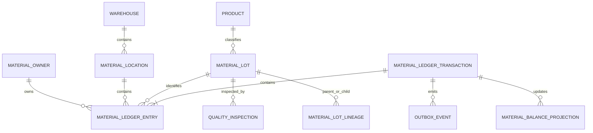

# Domain Models

## Material Owner

`material_owners` is a universal ownership account. Types are `COMPANY`, `CUSTOMER`, `SUPPLIER`, and `OTHER`. It has typed foreign-key columns to the existing customer or supplier where applicable; ledger entries reference this universal account rather than an unconstrained polymorphic id.

## Material Location

`material_locations` is a hierarchy scoped to operating entity, branch, and compatible warehouse. Types include receiving, quarantine, warehouse, silo, bin, WIP, packing, finished goods, dispatch, loss, variance, and virtual. It owns capacity, owner-mixing, lot-mixing, and quality-release policies.

## Material Lot

`material_lots` provides lot number, product, origin owner, origin document, quality status, traceability status, and optional legacy batch link. Current ownership and location are ledger-derived. `material_lot_lineage` records split, blend, transform, and repack relationships.

## Quality

`quality_inspections` holds moisture, impurities, protein, gluten, test weight, inspection outcome, approval, and lot relation. Quality status controls whether a lot may enter WIP or dispatch.

## WIP

WIP is a controlled material location plus, for company production, a cost pool managed by the Cost Engine. Customer WIP is physically tracked but excluded from company valuation.

## Loss and variance

Loss is an explicit classified movement: `MOISTURE`, `IMPURITY`, `PROCESS`, `DAMAGE`, or `UNEXPLAINED`. Variance is an approved balancing counterpart for adjustment/opening scenarios, not a normal product output.

## Reservation

Reservations are a separate planning domain. They reduce available-to-reserve, not physical balance. A reservation is released, consumed, or expired; it never substitutes for ledger posting.

## ERD

