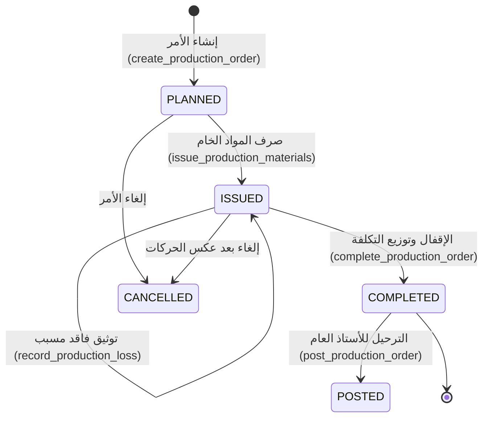
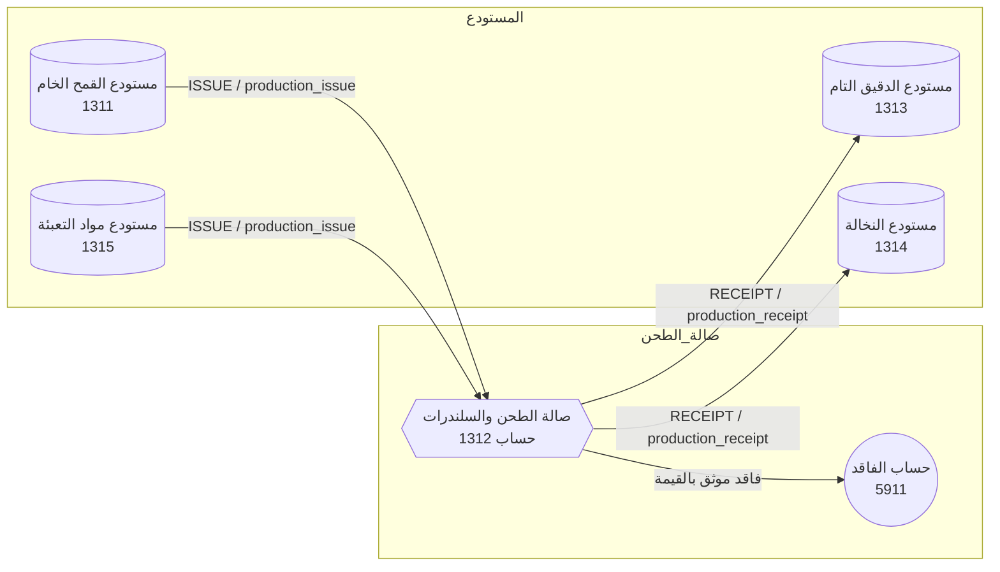

# خطة الإنتاج والتصنيع للمطحنة (المسار الصناعي والموسّع)

> وثيقة تحليلية وهندسية شاملة — مبنية بدقة على الكود الفعلي، جداول قاعدة البيانات، دوال المحرك، ونظام القيود المحاسبية في مشروع Market-Hub / Vortex ERP
>
> **تاريخ التوثيق:** 2026-10-04  
> **الإصدار:** 1.0  
> **الجمهور المستهدف:** مهندسو البرمجيات، محللو النظم، المحاسب المالي، ومدير تشغيل المطحنة  
> **المرجعية البرمجية الأساسية:** `src/lib/production/`, `src/routes/_app.production.tsx`, `src/lib/milling/`, `supabase/migrations/20261101*`, `20261203*`

---

## جدول المحتويات

1. [مقدمة وفلسفة التصنيع في المطحنة](#1-مقدمة-وفلسفة-التصنيع-في-المطحنة)
2. [المساران الأساسيان للتصنيع في النظام الحالي](#2-المساران-الأساسيان-للتصنيع-في-النظام-الحالي)
3. [دورة حياة أمر الإنتاج الصناعي خطوة بخطوة](#3-دورة-حياة-أمر-الإنتاج-الصناعي-خطوة-بخطوة)
4. [معالجة التكاليف المشتركة وتوزيعها (Joint Costing)](#4-معالجة-التكاليف-المشتركة-وتوزيعها-joint-costing)
5. [المحاسبة الصناعية والربط بدفتر الأستاذ العام (GL Posting)](#5-المحاسبة-الصناعية-والربط-بدفتر-الأستاذ-العام-gl-posting)
6. [إدارة المخزون وحركات المستودعات أثناء التصنيع](#6-إدارة-المخزون-وحركات-المستودعات-أثناء-التصنيع)
7. [أوامر تشغيل وطحن حبوب الغير (Milling as a Service - MaaS)](#7-أوامر-تشغيل-وطحن-حبوب-الغير-milling-as-a-service---maas)
8. [العلاقة بين أوامر الإنتاج وفواتير المبيعات](#8-العلاقة-بين-أوامر-الإنتاج-وفواتير-المبيعات)
9. [مخطط الكيانات وجداول قاعدة البيانات بالتفصيل](#9-مخطط-الكيانات-وجداول-قاعدة-البيانات-بالتفصيل)
10. [دوال ومحركات التشغيل في قاعدة البيانات (RPC Engine)](#10-دوال-ومحركات-التشغيل-في-قاعدة-البيانات-rpc-engine)
11. [شاشات وواجهات المستخدم الحالية](#11-شاشات-وواجهات-المستخدم-الحالية)
12. [مراقبة الفاقد، الأوزان، ونسب الاستخلاص (Yield & Gap Analysis)](#12-مراقبة-الفاقد-الأوزان-ونسب-الاستخلاص-yield--gap-analysis)
13. [القيود والقواعد الأمنية والتجارية الصارمة](#13-القيود-والقواعد-الأمنية-والتجارية-الصارمة)
14. [تحليل الواقع: ما هو موجود وما ينقص لاكتمال المنظومة](#14-تحليل-الواقع-ما-هو-موجود-وما-ينقص-لاكتمال-المنظومة)
15. [مقارنة معمارية بين الخطة المبسطة وخطة التصنيع](#15-مقارنة-معمارية-بين-الخطة-المبسطة-وخطة-التصنيع)
16. [التوصيات الهندسية والتشغيلية النهائية](#16-التوصيات-الهندسية-والتشغيلية-النهائية)

---

## 1. مقدمة وفلسفة التصنيع في المطحنة

في النشاط التجاري العادي، يشتري التاجر صنفاً ويبيعه بنفس هيئته (قمح ← قمح، أو دقيق معبأ ← دقيق معبأ). أما المطحنة في مسارها الصناعي الموسّع، فهي **منشأة تحويلية وتصنيعية متكاملة** تقوم بما يلي:

1. استهلاك مواد خام (`RAW_MATERIAL`) مثل حبوب القمح الصلب أو اللين ومواد تعبئة (`PACKAGING`) مثل الأكياس والخيوط.
2. استخدام عناصر تكلفة تحويلية: أجور عمالة مباشرة (`direct_labour`)، ومصروفات تشغيلية صناعية (`overhead_cost`) مثل الديزل والكهرباء وصيانة السيور والسلندرات ومستهلكات التشغيل.
3. تفكيك وتحويل المادة الخام الواحدة إلى **نواتج متعددة ومتزامنة**:
   - **ناتج رئيسي (`PRIMARY`):** الدقيق الفاخر بدرجاته (دقيق نمرة 1، دقيق زيرو، دقيق بر).
   - **ناتج ثانوي / عَرَضي (`BY_PRODUCT`):** النخالة (الردة)، كسر القمح، الجنين، السيمولينا.
   - **فاقد تشغيلي حتمي أو طارئ (`LOSS`):** فاقد الرطوبة والتبخر، غبار الطحن، شوائب الاستبعاد، أو تلف ميكانيكي.
4. حساب دقيق لتكلفة الكيلوغرام المنتج من كل نوع لتقييم مخزون السلع التامة (`FINISHED_GOOD`) والنواتج العرضية بطريقة محاسبية علمية متسقة مع معايير المحاسبة الدولية (IAS 2 - المخزون).

### مبدأ عدم المساس بالبناء الحالي
النظام الحالي في Market-Hub بُني على قاعدة معمارية متينة تفصل تماماً بين مسار خدمة الطحن لحساب الغير (حيث المخزون ملك العميل وأثره المالي صفر على أصول المطحنة) وبين مسار تصنيع المطحنة لملكها (حيث الحبوب أصل من أصول المطحنة وكل حركة تُسجل بتكلفة وقيد محاسبي دقيق).

هذه الوثيقة ترتكز بنسبة 100% على الكود الفعلي الموجود في الفروع والملفات الحالية، وتوثق دورة التصنيع الموسعة للمطورين وأصحاب القرار.

---

## 2. المساران الأساسيان للتصنيع في النظام الحالي

يحتوي مشروع Market-Hub على منظومتين برمجيتين متكاملتين تدعمان التصنيع والطحن، كل منهما مخصص لطبيعة ملكية محددة:

```
                      ┌───────────────────────────────────────────────┐
                      │          طبيعة عملية الطحن في المنشأة         │
                      └───────────────────────┬───────────────────────┘
                                              │
                    ┌─────────────────────────┴─────────────────────────┐
                    ▼                                                   ▼
     ┌─────────────────────────────┐                     ┌─────────────────────────────┐
     │ 1. تصنيع المطحنة لملكها     │                     │ 2. طحن أمانات الغير (خدمة)  │
     │    (The Mill's Own Goods)   │                     │    (Customer Custody Mill)  │
     ├─────────────────────────────┤                     ├─────────────────────────────┤
     │ • ملكية الحبوب: المطحنة     │                     │ • ملكية الحبوب: العميل      │
     │ • الشاشة: /production       │                     │ • الشاشة: /milling/jobs     │
     │ • المسار: lib/production/   │                     │ • المسار: lib/milling/      │
     │ • حركة المخزون: كاملة       │                     │ • حركة الحبوب بالمخزون: صفر │
     │ • التكلفة: صناعية كاملة     │                     │ • التكلفة: إيراد أجور طحن   │
     │ • المحاسبة: WIP + أستاذ عام │                     │ • المحاسبة: فواتير خدمات    │
     └─────────────────────────────┘                     └─────────────────────────────┘
```

### المسار الأول: تصنيع سلع المطحنة الخاصة (`/production`)
- **الهدف:** إنتاج دقيق المطحنة الذي يحمل علامتها التجارية ويباع بالجملة أو التجزئة في السوق.
- **التشغيل:** يتم استهلاك القمح المملوك للشركة من المستودع، وطحنه، ثم إيداع الدقيق والنخالة في مخزون الشركة بتكلفة مستنتجة ومعتمدة.

### المسار الثاني: أوامر طحن وتشغيل حبوب العملاء (`/milling/jobs`)
- **الهدف:** تشغيل مطاحن تجارية تستقبل حبوب المزارعين أو التجار لطحنها مقابل أجر نقدي محدد لكل كيس أو لكل طن.
- **التشغيل:** الحبوب تدخل كـ "أمانة" (`owner_type = 'CUSTOMER'`)، وتطحن عبر أمر طحن ذي مواصفات ونسب استخلاص متفق عليها، وتُسلم للعميل، وتصدر له فاتورة خدمة طحن وتعبئة.

---

## 3. دورة حياة أمر الإنتاج الصناعي خطوة بخطوة

يمر أمر الإنتاج الخاص بالمطحنة (`production_orders`) بدورة حياة محكمة الصياغة البرمجية، حيث تتحكم دوال قاعدة البيانات بصلاحية الانتقال من مرحلة لأخرى:



### الخطوة 1: التخطيط والوصفات المعيارية (`PLANNED`)
1. يختار المشغل المستودع (`warehouse_id`) الذي ستسحب منه الحبوب الخام وتودع فيه النواتج.
2. يختار وصفة الإنتاج المعيارية (`BOM`) إن وجدت من جدول `production_boms`.
   - الوصفة تحتوي على نسب المدخلات المتوقعة (`INPUT`)، النواتج الأساسية (`OUTPUT`)، النواتج العرضية (`BY_PRODUCT`)، والفاقد المعياري (`LOSS`).
3. يحدد **أساس توزيع التكلفة** (`allocation_basis`):
   - `REMAINDER_TO_PRIMARY` (الافتراضي والتحفظي).
   - `NET_REALISABLE_VALUE` (صافي القيمة البيعية).
   - `RELATIVE_SALES_VALUE` (القيمة البيعية النسبية).
4. تنفذ الدالة `create_production_order` في قاعدة البيانات:
   - يتولد رقم أمر فريد تسلسلي، مثل: `PO-20261004-0001`.
   - تنسخ سطور الوصفة إلى سطور الخطة المعيارية (`planned_qty`).
   - لا تتأثر أي حركة مخزنية أو مالية في هذه المرحلة.

### الخطوة 2: صرف المواد الخام وحساب تكلفة المدخلات (`ISSUED`)
1. يتم تحديد كميات القمح المسحوبة فعلياً من الصوامع أو المستودع.
2. تستدعي الواجهة دالة `issue_production_materials(_order_id, _product_id, _qty)`:
   - يتحقق النظام من وجود رصيد كافٍ مملوك للمطحنة حصراً (`owner_type = 'COMPANY' AND owner_id IS NULL`). الحبوب المودعة كأمانات للعملاء محظور صرفها نهائياً.
   - يسترجع النظام التكلفة الآنية للقمح باستخدام المتوسط المرجح المتحرك عبر الدالة `resolve_unit_cost(_product_id, _warehouse_id)`.
   - يتم تخفيض كمية المخزون الفعلي عبر استدعاء `post_stock_delta` مع حركة من نوع `ISSUE` ومصدر `production_issue`.
   - يتم تحديث طبقة التكلفة عبر `apply_cost_movement`.
   - يسجل سطر في جدول `production_order_materials` يحتوي على: الكمية المصروفة، تكلفة الوحدة، وإجمالي تكلفة المواد.
   - تتحول حالة الأمر آلياً إلى `ISSUED` ويرتفع عداد `actual_input_qty` و `material_cost`.

### الخطوة 3: مراحل الطحن والتشغيل الصناعي
تجري العمليات الفيزيائية داخل صالة المطحنة:
- **التنظيف والغربلة:** عزل الحصى، الأتربة، والقشور الخفيفة.
- **الترطيب (Conditioning/Tempering):** إضافة الماء للحبوب بنسبة محسوبة لإرخاء النخالة وتسهيل فصل الدقيق عن القشرة، وتركه في صوامع التخمير لفترة تتراوح بين 12 إلى 24 ساعة.
- **مرحلة الطحن بالسلندرات (Roller Mills):** تكسير القمح تدريجياً عبر سلندرات التفتيت وسلندرات التنعيم.
- **مرحلة النخل والفصل (Plansifters):** غربلة مخرجات الطحن عبر مناخل حريرية متعددة المقاسات لعزل الدقيق الفاخر عن السميد والنخالة.

### الخطوة 4: استلام النواتج في المستودع (`add_production_output`)
1. فور خروج الدقيق والنخالة وتعبئتها، يوثق أمين المستودع الاستلام الفعلي بالكيلوغرام.
2. يستدعي النظام دالة `add_production_output(_order_id, _product_id, _qty, _output_role)`:
   - يتم تحديد نوع الدور: أساسي (`PRIMARY`) كالدقيق، أو ناتج جانبي (`BY_PRODUCT`) كالنخالة.
   - يتحقق النظام من أن الصنف يقبل التخزين (`FINISHED_GOOD` أو `BY_PRODUCT`) ولا يقبل استلام خدمات أو أصناف غير مخزونة.
   - يتم إيداع الكمية الفيزيائية في المستودع فوراً عبر `post_stock_delta` مع نوع حركة `RECEIPT`.
   - **ملاحظة معمارية جوهرية:** تكلفة الوحدة تظل مؤقتاً صفر (`0`) في هذه اللحظة؛ لأن تكلفة الكيلوغرام لا يمكن معرفتها بدقة إلا بعد انتهاء التشغيل واحتساب كامل التكاليف المشتركة والمصروفات الإضافية.

### الخطوة 5: توثيق الفاقد والعجز المسبب (`record_production_loss`)
1. في نهاية دورة الطحن، يتبقى فرق بين وزن الحبوب المصروفة وإجمالي أوزان الدقيق والنخالة الناتجة.
2. يسجل المشغل الفاقد عبر `record_production_loss(_order_id, _reason, _qty, _notes)`:
   - يجب إدخال سبب صريح وموثق للفاقد (مثلاً: "فاقد رطوبة طبيعي"، "غبار طحن بالشفاطات"، "شوائب منخل التنظيف").
   - يحسب النظام قيمة الفاقد المالية بناءً على متوسط تكلفة القمح الداخل للأمر:
     $$\text{Value} = \text{Loss Qty} \times \left(\frac{\text{Total Material Cost}}{\text{Total Input Qty}}\right)$$
   - يُقيد الفاقد في جدول `production_order_losses`.

### الخطوة 6: الإقفال وتوزيع التكاليف المشتركة (`complete_production_order`)
1. يدخل المشغل أو مدير الإنتاج تكاليف التحويل المباشرة وغير المباشرة:
   - **أجور العمالة المباشرة (`direct_labour`):** أجور الفنيين والعمال في وردية الطحن.
   - **المصروفات الصناعية غير المباشرة (`overhead_cost`):** تقدير نصيب الأمر من الديزل، استهلاك الكهرباء، وصيانة الآلات.
2. يستدعي النظام دالة `complete_production_order(_order_id, _overhead, _labour)`:
   - **فحص توازن المادة (Mass Balance Guard):**
     $$\text{Gap} = \text{Input Qty} - \text{Output Qty} - \text{Loss Qty}$$
     * إذا كان $\text{Gap} < -0.001$ (أي النواتج + الفاقد تتجاوز المدخلات)، يرفض النظام العملية فوراً ويطلق استثناءً؛ لأن النظام يمنع خلق المادة من العدم.
     * إذا كان هناك عجز إيجابي غير موثق ($\text{Gap} > 0$)، يقوم المحرك برصده وتنبيه المشغل.
   - يتم احتساب إجمالي تكلفة الأمر:
     $$\text{Total Production Cost} = \text{Material Cost} + \text{Direct Labour} + \text{Overhead Cost}$$
   - يتم توزيع التكلفة بين الناتج الأساسي والنواتج الجانبية بحسب أساس التوزيع المعتمد (انظر القسم 4).
   - يتم تحديث طبقة التكلفة (`item_valuation` و `cost_layers`) لجميع السلع التامة والنواتج الجانبية بقيمتها النهائية المكتسبة.
   - تتحول حالة الأمر إلى `COMPLETED`.

### الخطوة 7: الترحيل المحاسبي إلى الأستاذ العام (`post_production_order`)
1. يقوم المحاسب المالي أو المدير بالضغط على ترحيل الأمر المكتمل.
2. تنفذ الدالة `post_production_order(_order_id)` التي تولد قيدين مزدوجين متطابقين في `journal_entries` وتحدث حالة العرض في `production_ledger_status` إلى `POSTED`.

---

## 4. معالجة التكاليف المشتركة وتوزيعها (Joint Costing)

من أكبر التحديات المحاسبية في المطاحن هي أن القمح يفرز في نفس اللحظة دقيقاً فاخراً ونخالة. كلاهما اشترك في نفس حبة القمح، ونفس استهلاك الكهرباء، ونفس أجور الطحانين.

يوفر محرك Market-Hub (`supabase/migrations/20261101010000_production_engine.sql`) ثلاثة خيارات دقيقة ومحددة:

```
                                  إجمالي تكاليف أمر الإنتاج
                           (خامات + أجور مباشرة + مصاريف تشغيل)
                                            │
               ┌────────────────────────────┼────────────────────────────┐
               ▼                            ▼                            ▼
      الخيار الأول (المحافظ)           الخيار الثاني                الخيار الثالث
     REMAINDER_TO_PRIMARY         NET_REALISABLE_VALUE         RELATIVE_SALES_VALUE
   ┌───────────────────────┐    ┌───────────────────────┐    ┌───────────────────────┐
   │ النخالة تكفتها = 0     │    │ النخالة تخصم بسعر     │    │ تقسم التكلفة بنسبة    │
   │ الدقيق يتحمل 100% من  │    │ بيعها الصافي من تكلفة │    │ القيمة البيعية السوقية │
   │ التكلفة المشتركة      │    │ الأمر، والباقي للدقيق │    │ بين الدقيق والنخالة   │
   └───────────────────────┘    └───────────────────────┘    └───────────────────────┘
```

### 1. أساس "الباقي على الأساسي" (`REMAINDER_TO_PRIMARY`) — الخيار الافتراضي والمحافظ
- **المفهوم:** يُعامل الدقيق باعتباره الهدف الأوحد من عملية الطحن، وتُعتبر النخالة عَرَضاً لا يستحق تحميله تكلفة تصنيع.
- **الحسبة:**
  - تكلفة النواتج الثانوية (`BY_PRODUCT`): تُسجل تكلفة الوحدة = 0، وإجمالي التكلفة = 0.
  - تكلفة الناتج الأساسي (`PRIMARY`): يتحمل كامل تكلفة الإنتاج:
    $$\text{Unit Cost (Flour)} = \frac{\text{Total Production Cost}}{\text{Primary Output Qty}}$$
- **الأثر العملي:** مخزون النخالة يدخل المستودع بتكلفة صفرية، وعند بيعه مستقبلاً يكون إيراده ربحاً إجمالياً بنسبة 100%، بينما يظهر الدقيق بتكلفة إنتاجية كاملة ومتحفظة.

### 2. أساس "صافي القيمة البيعية" (`NET_REALISABLE_VALUE - NRV`) — المعيار الاقتصادي الأدق
- **المفهوم:** تُقيّم النخالة بسعر بيعها السوقي التقديري، ويُخصم هذا المبلغ كـ "استرداد تكلفة" من إجمالي تكاليف الطحن، وما يتبقى يذهب لتكلفة الدقيق.
- **الحسبة:**
  $$\text{By-Product Value} = \sum (\text{Actual Qty} \times \text{Product Sale Price})$$
  $$\text{Primary Net Cost} = \text{Total Production Cost} - \text{By-Product Value}$$
  $$\text{Unit Cost (Flour)} = \frac{\text{Primary Net Cost}}{\text{Primary Output Qty}}$$
- **التحقق البرمجي في الكود:** إذا تجاوزت القيمة السوقية للنخالة إجمالي تكلفة الأمر (وهو خطأ في تسعير البيع)، يمنع المحرك الإقفال فوراً:
  ```sql
  IF v_byprod_value > v_total THEN
    RAISE EXCEPTION 'By-product realisable value exceeds total production cost...';
  END IF;
  ```

### 3. أساس "القيمة البيعية النسبية" (`RELATIVE_SALES_VALUE`)
- **المفهوم:** يتم توزيع إجمالي تكلفة الإنتاج على كل من الدقيق والنخالة معاً، بالتناسب مع القيمة السوقية الإجمالية لكل صنف عند نقطة الانفصال (Split-off Point).

---

## 5. المحاسبة الصناعية والربط بدفتر الأستاذ العام (GL Posting)

تم تصميم الترحيل المحاسبي للإنتاج في الملف `20261203010000_post_production_orders_to_ledger.sql` وفق نظام **القيد المزدوج المكتمل عبر حساب الإنتاج تحت التشغيل (Work-in-Progress - WIP)**.

### لماذا تم استخدام حساب الإنتاج تحت التشغيل (1312)؟
أمر الطحن في المطاحن الكبرى قد يستغرق ورديتين أو ثلاثة أيام. في اليوم الأول تم سحب 50 طن قمح بقيمة 150,000 ريال. إذا لم يتم استخدام حساب وسيط، ستختفي هذه الحبوب من الأصول المتداولة لمدة يومين، وتظهر الميزانية بعجز مؤقت غير حقيقي. وجود حساب `1312` يُثبت أن المواد لم تضع بل تحولت إلى أصل وسيط يجري تصنيعه داخل المطحنة.

### القيود المحاسبية الآلية الصادرة عن كل أمر إنتاج:

#### القيد الأول (Entry A): عند صرف المواد الخام إلى صالة الطحن
يُنشأ القيد بتاريخ بدء الصرف لإخلاء عهدة مستودع الحبوب وتحميلها على حساب التشغيل:

| رقم الحساب | اسم الحساب | مدين (Debit) | دائن (Credit) | البيان (Memo) |
|------------|------------|--------------|---------------|---------------|
| **1312** | إنتاج تحت التشغيل (WIP) | **مجموع تكلفة المواد المصروفة** | — | إنتاج تحت التنفيذ — أمر إنتاج [رقم الأمر] |
| **1311** | مخزون مواد خام (قمح) | — | **تكلفة القمح المصروف** | صرف مواد إنتاج من مستودع المواد الخام |
| **1315** | مخزون مواد تعبئة وتغليف | — | **تكلفة الأكياس المستخدمة** | صرف أكياس تعبئة لأمر الإنتاج |

#### القيد الثاني (Entry B): عند إقفال أمر الإنتاج واعتماد التكلفة
يُنشأ القيد بتاريخ إقفال الأمر لتسجيل المنتجات الجاهزة والاعتراف بالفواقد وإقفال حساب التشغيل وإثبات المصاريف المحملة:

| رقم الحساب | اسم الحساب | مدين (Debit) | دائن (Credit) | البيان (Memo) |
|------------|------------|--------------|---------------|---------------|
| **1313** | مخزون إنتاج تام (دقيق فاخر/بر) | **التكلفة المحملة للدقيق** | — | إيداع سلع تامة لأمر إنتاج [رقم الأمر] |
| **1314** | مخزون نواتج ثانوية (نخالة) | **التكلفة المحملة للنخالة** | — | إيداع نواتج ثانوية لأمر إنتاج [رقم الأمر] |
| **5911** | فاقد وعجز الإنتاج الصناعي | **القيمة النقدية للفاقد المسبب** | — | فاقد إنتاج معتمد لأمر [رقم الأمر] |
| **1312** | إنتاج تحت التشغيل (WIP) | — | **إجمالي تكلفة المواد المقفلة** | إقفال وتصفية رصيد التشغيل للأمر |
| **5211** | أجور عمالة صناعية مباشرة محملة | — | **مبلغ الأجور المباشرة** | أجور عمالة محملة على تشغيل المطحنة |
| **5311** | مصروفات صناعية غير مباشرة محملة | — | **مبلغ مصاريف التشغيل (ديزل/كهرباء)** | مصروفات تشغيل غير مباشرة محملة |

### قاعدة الفاقد كمصروف مستقل (Expense Line not Absorbed):
> **مبدأ محاسبي حاسم في الكود:**  
> الحساب `5911` يُحسب بالمعادلة:
> $$\text{Loss Value} = \text{Total Order Cost} - \text{Total Output Valuation}$$
> إذا حدث هدر وزني بقيمة 1,200 ريال نتيجة تسرب في الشفاط أو تلف حزام، فإن النظام **لا يقوم بدفن هذا الهدر سراً داخل تكلفة الدقيق** ليرفع متوسط تكلفة الكيلو بشكل مضلل، بل يُظهره في سطر مستقل في قائمة الدخل تحت حساب `5911` في نفس الفترة المالية التي وقع فيها الهدر.

---

## 6. إدارة المخزون وحركات المستودعات أثناء التصنيع

تعتمد إدارة المخزون على عزل كامل للملكيات ومتابعة دقيقة لكل غرام يتحرك داخل المستودع:



### 1. سياسة العزل بين ملكية الشركة وأمانات العملاء
في جدول `inventory`:
- الأصناف التي يملكها المطحن تسجل بـ: `owner_type = 'COMPANY' AND owner_id IS NULL`.
- حبوب المزارعين والزبائن تسجل بـ: `owner_type = 'CUSTOMER' AND owner_id = [customer_uuid]`.
- محرك الإنتاج يفحص هذا الشرط صراحة ويمنع صرف أي غرام من أمانات العملاء لحساب أمر إنتاج المطحنة:
  ```sql
  LEFT JOIN public.inventory i
    ON i.product_id = p.id AND i.warehouse_id = v_ord.warehouse_id
   AND i.owner_type = 'COMPANY'::public.owner_type AND i.owner_id IS NULL
  ```

### 2. تسلسل حركات المخزون في جدول `stock_movements`
لكل عملية في أمر الإنتاج سجل مناظر في جدول حركات المخزون العام:
- عند صرف القمح: ينشأ سجل `stock_movements` بنوع `ISSUE`، والكمية سالبة (`-qty`)، ومصدر الحركة `production_issue`، ومعرف المصدر هو معرف أمر الإنتاج `order_id`.
- عند استلام الدقيق: ينشأ سجل بنوع `RECEIPT`، والكمية موجبة (`+qty`)، ومصدر الحركة `production_receipt`.

---

## 7. أوامر تشغيل وطحن حبوب الغير (Milling as a Service - MaaS)

بجانب التصنيع الذاتي، يحتوي النظام على مسار متكامل لتشغيل وطحن حبوب العملاء لحسابهم في المجلد `src/lib/milling/`:

### الفروق التشغيلية في طحن الأمانات:
1. **استلام الحبوب (`MillingIntake`):**
   - يدخل القمح بوزن قائم (`gross_weight_kg`)، وزن فارغ للشاحنة (`tare_weight_kg`)، ووزن صافٍ (`net_weight_kg`).
   - فحص جودة الحبوب ومطابقتها للمواصفات: نسبة الرطوبة (`moisture_percentage`) ونسبة الشوائب (`impurities_percentage`) والدرجة (`grain_grade_id`).
   - لا ينشأ أي أثر مالي أو مخزني للمطحنة، بل يسجل إيداع أمانة بحوزة المطحنة لصالح العميل.
2. **اتفاقية الطحن (`MillingServiceAgreement`):**
   - تحديد أساس الأجرة: أجر لكل كيس (`PER_BAG`) أو أجر لكل طن قمح صافٍ (`PER_NET_TON`).
   - تحديد نسبة الاستخراج التعاقدية (`expected_extraction_rate`) مثلاً 78% دقيق، و 20% نخالة، و 2% فاقد مسموح.
3. **أمر الطحن (`MillingJob`):**
   - يربط إيصال استلام القمح، ويحدد عدد الأكياس المسحوبة للتشغيل.
   - تحديد مصدر أكياس التعبئة (`bags_source`):
     * إذا أحضر العميل أكياسه الخاصة (`CUSTOMER`): لا يتأثر مخزون المطحنة.
     * إذا استخدم العميل أكياس المطحنة (`MILL`): تُسحب الأكياس من مخزون المطحنة وتُدرج قيمتها كبند مستحق في فاتورة الخدمة.
4. **تسليم المخرجات (`MillingDelivery`):**
   - إصدار سند خروج وتسليم رسمي بالدقيق والنخالة المحملة على شاحنة العميل بعد وزنها وتوقيع السائق.
5. **الفاتورة النهائية (`invoiceJob`):**
   - تصدر فاتورة مبيعات خدمات (`INVOICE`) تحتوي فقط على: أجور الطحن + ثمن أكياس التعبئة المباعة له، دون أي تسعير للقمح أو الدقيق المسلم.

---

## 8. العلاقة بين أوامر الإنتاج وفواتير المبيعات

تختلف علاقة أمر الإنتاج بالفاتورة بحسب المسار التشغيلي:

### في مسار تصنيع المطحنة لملكها (`/production`):
- **أمر الإنتاج لا ينتج عنه فاتورة:** أمر الإنتاج هو مستند تحويلي داخلي بين حسابات الأصول والمصاريف. لا يوجد طرف ثانٍ (عميل) لتصدر له فاتورة في هذه اللحظة.
- **كيف يتحول الإنتاج إلى إيراد وفاتورة مبيعات؟**
  1. يقوم أمر الإنتاج بضخ كميات الدقيق والنخالة في جدول السلع التامة (`products` و `inventory`).
  2. تصبح هذه السلع جاهزة للبيع عبر شاشة نقاط البيع (`/pos`) أو شاشة فواتير المبيعات (`/invoices`).
  3. عندما يشتري العميل 50 كيس دقيق نمرة 1، تصدر له فاتورة مبيعات عادية:
     * إيراد مبيعات: بسعر البيع المحدد في الفاتورة.
     * تكلفة البضاعة المباعة (COGS): تُحسب آلياً من التكلفة التي استنتجها أمر الإنتاج وقيدها في طبقة التكلفة `item_valuation`.

### في مسار طحن الأمانات (`/milling`):
- يرتبط أمر الطحن مباشرة بفاتورة مبيعات خدمة عبر استدعاء دالة `invoice_milling_job`:
  - يتولد قيد مالي يسجل:
    * مدين: العميل (أو الصندوق/البنك).
    * دائن: إيراد خدمات طحن (حساب الإيرادات).
    * دائن: مبيعات مواد تعبئة (إن استهلك أكياس المطحنة).
    * مدين: تكلفة بضاعة مباعة (للأكياس)، دائن: مخزون أكياس التعبئة.

---

## 9. مخطط الكيانات وجداول قاعدة البيانات بالتفصيل

### 1. جداول التصنيع الخاص بالمطحنة (`production_*`)

#### جدول وصفات الإنتاج المعيارية: `production_boms`
| الحقل | النوع | القيود | الوصف |
|-------|-------|--------|-------|
| `id` | uuid | PK | المعرف الفريد للوصفة |
| `product_id` | uuid | FK -> products | المنتج النهائي المستهدف (الدقيق) |
| `name_ar` | text | NOT NULL | اسم الوصفة (مثال: خلطة دقيق أبيض ممتاز طن واحد) |
| `output_qty` | numeric(18,3) | > 0 | حجم الدفعة المعيارية المنتجة بالكيلو |
| `output_unit` | text | DEFAULT 'KG' | وحدة القياس |
| `is_active` | boolean | DEFAULT true | هل الوصفة مفعلة للإنتاج |
| `created_by` | uuid | FK -> auth.users | المستخدم المنشئ |
| `created_at` | timestamptz | DEFAULT now() | تاريخ الإنشاء |

#### جدول سطور الوصفة: `production_bom_lines`
| الحقل | النوع | القيود | الوصف |
|-------|-------|--------|-------|
| `id` | uuid | PK | المعرف الفريد للسطر |
| `bom_id` | uuid | FK -> production_boms | الوصفة التابع لها السطر |
| `product_id` | uuid | FK -> products (Nullable) | مادة خام أو ناتج (يكون NULL في سطور الفاقد) |
| `line_role` | text | CHECK IN ('INPUT','OUTPUT','BY_PRODUCT','LOSS') | دور السطر في الوصفة |
| `qty` | numeric(18,3) | > 0 | الكمية المعيارية المطلوبة أو الناتجة |
| `unit` | text | DEFAULT 'KG' | وحدة القياس |
| `loss_reason` | text | Nullable | سبب الفاقد في حالة سطور LOSS |
| `notes` | text | Nullable | ملاحظات تشغيلية |

#### جدول أوامر الإنتاج: `production_orders`
| الحقل | النوع | القيود | الوصف |
|-------|-------|--------|-------|
| `id` | uuid | PK | المعرف الفريد لأمر الإنتاج |
| `order_number` | text | UNIQUE, NOT NULL | رقم الأمر (مثل: `PO-20261004-0001`) |
| `warehouse_id` | uuid | FK -> warehouses | المستودع التشغيلي للأمر |
| `bom_id` | uuid | FK -> production_boms | الوصفة المستند إليها (اختياري) |
| `production_date`| date | DEFAULT CURRENT_DATE | تاريخ الإنتاج الفعلي |
| `status` | text | CHECK IN ('PLANNED','ISSUED','COMPLETED','CANCELLED') | حالة الأمر |
| `planned_input_qty`| numeric(18,3) | DEFAULT 0 | إجمالي كمية المواد المخطط صرفها |
| `planned_output_qty`| numeric(18,3)| DEFAULT 0 | إجمالي كمية النواتج المخططة |
| `planned_yield_pct`| numeric(7,3) | Nullable | نسبة الاستخراج المخططة % |
| `actual_input_qty` | numeric(18,3)| DEFAULT 0 | الوزن الفعلي للمواد المصروفة من المخزون |
| `actual_output_qty`| numeric(18,3)| DEFAULT 0 | الوزن الفعلي للنواتج المستلمة |
| `actual_yield_pct` | numeric(7,3) | Nullable | نسبة الاستخراج الفعلية المتحققة % |
| `material_cost` | numeric(18,2) | DEFAULT 0 | إجمالي تكلفة المواد الخام المصروفة |
| `direct_labour` | numeric(18,2) | DEFAULT 0 | أجور العمالة الصناعية المباشرة المحملة |
| `overhead_cost` | numeric(18,2) | DEFAULT 0 | المصروفات الصناعية غير المباشرة (ديزل/كهرباء) |
| `total_cost` | numeric(18,2) | DEFAULT 0 | إجمالي تكلفة أمر الإنتاج الكلية |
| `costing_method` | costing_method| DEFAULT 'MOVING_AVERAGE' | طريقة التقييم المعتمدة |
| `allocation_basis`| text | CHECK IN ('REMAINDER_TO_PRIMARY', 'NET_REALISABLE_VALUE', 'RELATIVE_SALES_VALUE') | أساس توزيع التكلفة المشتركة |
| `completed_by` | uuid | FK -> auth.users | المستخدم الذي اعتمد إقفال الأمر |
| `completed_at` | timestamptz | Nullable | توقيت الإقفال |
| `notes` | text | Nullable | ملاحظات الأمر |

#### جدول مواد أمر الإنتاج: `production_order_materials`
| الحقل | النوع | الوصف |
|-------|-------|-------|
| `id` | uuid | معرف السطر |
| `order_id` | uuid | معرف أمر الإنتاج |
| `product_id` | uuid | معرف المادة الخام (القمح / الأكياس) |
| `planned_qty` | numeric(18,3) | الكمية المخططة حسب الوصفة |
| `actual_qty` | numeric(18,3) | الكمية المصروفة فعلياً من المخزون |
| `unit_cost` | numeric(18,4) | تكلفة الوحدة اللحظية للمادة وقت الصرف |
| `total_cost` | numeric(18,2) | التكلفة الإجمالية = الكمية × تكلفة الوحدة |
| `movement_id` | uuid | معرف حركة المخزون في `stock_movements` |

#### جدول مخرجات ونواتج أمر الإنتاج: `production_order_outputs`
| الحقل | النوع | الوصف |
|-------|-------|-------|
| `id` | uuid | معرف السطر |
| `order_id` | uuid | معرف أمر الإنتاج |
| `product_id` | uuid | معرف المنتج الناتج (دقيق / نخالة / سميد) |
| `output_role` | text | دور الناتج: `PRIMARY` أو `BY_PRODUCT` |
| `planned_qty` | numeric(18,3) | الكمية المخططة |
| `actual_qty` | numeric(18,3) | الكمية المستلمة فعلياً في المستودع |
| `unit_cost` | numeric(18,4) | تكلفة الكيلو المخصصة بعد إقفال الأمر |
| `total_cost` | numeric(18,2) | إجمالي التكلفة المخصصة لهذا الناتج |
| `movement_id` | uuid | معرف حركة استلام المخزون |

#### جدول فواقد الإنتاج: `production_order_losses`
| الحقل | النوع | الوصف |
|-------|-------|-------|
| `id` | uuid | معرف السجل |
| `order_id` | uuid | معرف أمر الإنتاج |
| `reason` | text | سبب الفاقد (مطلوب إلزامياً ولا يقبل فارغاً) |
| `qty` | numeric(18,3) | وزن الفاقد بالكيلوغرام (> 0) |
| `value` | numeric(18,2) | القيمة المالية المحسوبة للهدر بالريال |
| `notes` | text | ملاحظات إضافية وتوضيح مكان الهدر |

#### فيو حالة الإنتاج في الأستاذ العام: `production_ledger_status`
فيو استعلامي يربط كل أمر إنتاج بقيده في `journal_entries` ويحسب:
- `loss_value`: القيمة المحاسبية للفاقد بالريال.
- `ledger_state`: حالة الترحيل (`POSTED`, `NOT_POSTED`, `NOT_POSTABLE`).

---

## 10. دوال ومحركات التشغيل في قاعدة البيانات (RPC Engine)

كل عمليات الكتابة تتم عبر دوال `SECURITY DEFINER` محكمة الصلاحيات:

```sql
-- 1. فتح أمر إنتاج جديد
create_production_order(
  _warehouse_id     uuid,
  _bom_id           uuid DEFAULT NULL,
  _production_date  date DEFAULT CURRENT_DATE,
  _allocation_basis text DEFAULT 'REMAINDER_TO_PRIMARY',
  _notes            text DEFAULT NULL
) RETURNS uuid;

-- 2. صرف مواد خام للأمر
issue_production_materials(
  _order_id   uuid,
  _product_id uuid,
  _qty        numeric
) RETURNS uuid;

-- 3. استلام ناتج في المستودع
add_production_output(
  _order_id     uuid,
  _product_id   uuid,
  _qty          numeric,
  _output_role  text DEFAULT 'PRIMARY'
) RETURNS uuid;

-- 4. توثيق فاقد تشغيلي مسبب
record_production_loss(
  _order_id uuid,
  _reason   text,
  _qty      numeric,
  _notes    text DEFAULT NULL
) RETURNS uuid;

-- 5. إقفال الأمر وتوزيع التكلفة
complete_production_order(
  _order_id       uuid,
  _overhead_cost  numeric DEFAULT 0,
  _direct_labour  numeric DEFAULT 0
) RETURNS uuid;

-- 6. ترحيل القيود إلى دفتر الأستاذ العام
post_production_order(
  p_order_id uuid
) RETURNS uuid;
```

---

## 11. شاشات وواجهات المستخدم الحالية

### 1. شاشة إنتاج المطحنة الرئيسية (`src/routes/_app.production.tsx`)
الشاشة مصممة للمشرف الصناعي وأمين المخزون، وتحتوي على:
- **شريط المؤشرات العليا (KPI Cards):**
  - إجمالي أوامر الإنتاج.
  - الأوامر المكتملة.
  - إجمالي الكيلوغرامات المنتجة.
  - **مؤشر الخطر:** عدد الأوامر التي تحتوي على فرق وزن غير مفسر (`unreconciled gap`).
- **شريط إنشاء أمر جديد:** اختيار المستودع، وتحديد أساس التوزيع مع عرض توضيحي فوري لأثر الأساس المختار.
- **جدول أوامر الإنتاج:** عرض رقم الأمر، التاريخ، الحالة مع شارات ملونة، الوزن الداخل، الوزن الخارج، نسبة الاستخلاص الفعلي مع تلوين تحذيري بالأحمر إن قلت النسبة عن 75%، والتكلفة الإجمالية.
- **لوحة صرف المواد:** تعرض فقط المواد الخام المتاحة والمملوكة فعلياً للشركة بالمستودع المحدد ورصيد كل صنف بالكيلو.
- **لوحة استلام النواتج:** تتيح استلام الأصناف المصنفة كـ `FINISHED_GOOD` أو `BY_PRODUCT` مع تحديد دور الناتج.
- **لوحة تسجيل الفاقد:** إدخال كمية الهدر مع السبب الإلزامي.
- **لوحة إقفال الأمر ومراقبة الفارق غير المفسر:**
  - عرض قيمة الفارق: $\Delta = \text{Input} - \text{Output} - \text{Loss}$.
  - إذا كان الفارق صفراً يظهر بالأخضر ("الحساب متوازن").
  - حقول إدخال الأجور المباشرة والمصروفات الإضافية قبل ضغط زر "إقفال وتوزيع التكلفة".

### 2. شاشات طحن الأمانات المرتبطة:
- `src/routes/_app.milling.jobs.tsx`: صالة تشغيل أوامر طحن حبوب الغير ومتابعة استخراج الدقيق بحسب الاتفاقيات.
- `src/routes/_app.milling.intake.tsx`: تفريغ شاحنات القمح الوارد وتسجيل الأوزان وفحوصات الجودة.
- `src/routes/_app.milling.delivery.tsx`: تسليم أكياس الدقيق والنخالة للعميل وطباعة سند التسليم.
- `src/routes/_app.milling.reports.tsx`: تقارير تشغيلية وتجارية لأداء المطحنة ونسب الاستخراج وفروقات الأوزان.

---

## 12. مراقبة الفاقد، الأوزان، ونسب الاستخلاص (Yield & Gap Analysis)

تعتمد كفاءة المطحنة وربحيتها بالدرجة الأولى على **نسبة الاستخلاص (Extraction Rate / Yield %)** وضبط فواقد الطحن:

### 1. معادلة نسبة الاستخلاص
$$\text{Yield \%} = \frac{\text{Actual Output Weight (Flour)}}{\text{Actual Input Weight (Grain)}} \times 100$$
- في القمح الممتاز، تتراوح نسبة استخراج الدقيق الفاخر عادة بين **72% و 78%**.
- النخالة تشكل عادة بين **18% و 22%**.
- الفواقد والشوائب والرطوبة تتراوح بين **1.5% و 3%**.

### 2. مفهوم الفرق غير المفسر (`unreconciled`)
في الكود (`src/lib/production/index.ts`):
```typescript
export function unreconciled(order: ProductionOrder, totalLoss: number): number {
  return Number(order.actual_input_qty) - Number(order.actual_output_qty) - totalLoss;
}
```
الرقم المتبقي هو وزن فيزيائي دخل المطحنة ولم يخرج دقيقاً ولا نخالة ولم يُسجل كفاقد:
- إذا أغلق المشغل الأمر بوجود هذا الفارق، يقوم النظام برصد هذا العجز وتحميله محاسبياً.
- يمنع النظام تماماً الإقفال إذا كان الناتج أكبر من المدخل (فارق سالب)، لأن ذلك يعني وجود خطأ في ميزان الدقيق أو محاولة لتسجيل كميات وهمية.

---

## 13. القيود والقواعد الأمنية والتجارية الصارمة

1. **حظر الإدخال والتعديل المباشر من المتصفح (No Browser Table Writes):**
   جداول `production_*` محمية بـ RLS ولا تسمح بـ `INSERT` أو `UPDATE` من العميل إطلاقاً؛ لضمان أن كل حركة تمر عبر دوال المحرك التي تتحقق من المخزون والتكلفة والتوازن الرياضي.
2. **صلاحية تشغيل المطحنة:**
   جميع دوال الإنتاج تفحص صلاحية المستخدم عبر `public.can_operate_milling()` أو الأدوار المعتمدة (`owner`, `manager`, `accountant`).
3. **حظر صرف أمانات الغير:**
   يمنع المحرك منعاً باتاً صرف حبوب تحمل `owner_type = 'CUSTOMER'` في أوامر إنتاج المطحنة الخاصة.
4. **حظر استلام الخدمات كناتج مخزني:**
   يمنع استلام صنف من نوع `SERVICE` أو غير مخزون كنتيجة لأمر طحن.
5. **منع الإقفال بتكلفة صفرية:**
   قيد في جدول قاعدة البيانات (`production_orders_completed_has_cost`):
   ```sql
   CHECK (status <> 'COMPLETED' OR total_cost > 0)
   ```
   لا يمكن لأمر إنتاج أن يعتبر مكتملاً ومخزونه مقيماً بريال واحد إذا لم تكن هناك تكلفة مواد فعلية مسجلة.
6. **منع تكرار الترحيل للأستاذ العام:**
   تفحص دالة `post_production_order` جدول `journal_entries` وتمنع ترحيل نفس الأمر مرتين لمنع ازدواجية القيود المالية.

---

## 14. تحليل الواقع: ما هو موجود وما ينقص لاكتمال المنظومة

### ما هو مكتمل ومبني بنسبة 100% في المشروع:
- [x] هيكل الجداول الكامل في قاعدة البيانات (`production_orders`, `materials`, `outputs`, `losses`, `boms`, `bom_lines`).
- [x] محرك العمليات الرياضية والتخزينية (`create`, `issue`, `output`, `loss`, `complete`).
- [x] خوارزميات توزيع التكاليف المشتركة الثلاثة (`NRV`, `Relative Sales`, `Remainder to Primary`).
- [x] محرك ترحيل القيود إلى الأستاذ العام عبر حساب `1312 WIP` وحساب الهدر `5911`.
- [x] واجهة React متكاملة لإدارة الأوامر والصرف والاستلام والإقفال في `src/routes/_app.production.tsx`.
- [x] منظومة كاملة موازية لطحن أمانات العملاء والاتفاقيات وفحص جودة الحبوب في `src/lib/milling/`.

### ما ينقص أو يوصى بإضافته لتحقيق أعلى درجات الأتمتة:

| المكون الناقص / المقترح | الأهمية | الموقع المقترح في الكود | الوصف الهندسي |
|-------------------------|---------|-------------------------|---------------|
| **واجهة إدارة الوصفات (BOM Builder UI)** | متوسطة | تبويب جديد في `_app.production.tsx` أو صفحة منفصلة | واجهة رسومية تمكن مدير الإنتاج من إنشاء وتعديل وصفات خلطات القمح ونسب الاستخراج المتوقعة دون الاعتماد على مدخلات قاعدة البيانات المباشرة. |
| **زر الترحيل المباشر للأستاذ العام من الشاشة** | عاجلة | بطاقة إقفال الأمر في `_app.production.tsx` | ربط استدعاء دالة `post_production_order` بزر مرئي للمحاسب/المدير في شاشة الإنتاج بدلاً من ترحيلها برمجياً فقط. |
| **تتبع دفعات الحبوب (Batch / Lot Tracking)** | مستقبلية | جدول `stock_movements` وحقل `lot_number` | تتبع رقم الصومعة أو شحنة القمح الموردة لربطها بإنتاجية الدقيق الناتج واسترجاع أي دفعة معيبة. |
| **مراحل الطحن الفرعية (Sub-stages)** | اختيارية | جدول وسيط `production_stages` | توثيق أوقات الترطيب والتخمير ودرجة حرارة السلندرات للمطاحن الصناعية الكبرى التي تحتاج تتبعاً فسيولوجياً وميكانيكياً دقيقاً. |

---

## 15. مقارنة معمارية بين الخطة المبسطة وخطة التصنيع

| وجه المقارنة | الخطة المبسطة للمطحنة (`Simplified`) | خطة الإنتاج والتصنيع الموسعة (`Manufacturing`) |
|--------------|--------------------------------------|-----------------------------------------------|
| **الفكرة الأساسية** | استقبال ← طحن مباشر ← فاتورة مبيعات/خدمة | تخطيط ← وصفة ← صرف مواد ← استلام نواتج ← تكاليف ← أستاذ عام |
| **مستوى التعقيد** | بسيط جداً وسريع للعمليات اليومية | احترافي ومحكم للمصانع والمنشآت التحويلية |
| **ملكية الحبوب المستهدفة** | حبوب العميل أو بيع مباشر لدقيق مشترى جاهز | حبوب المطحنة الخاصة المخزنة في الصوامع |
| **حساب تكلفة الدقيق** | متوسط سعر شراء الدقيق أو الحبوب مباشرة | تكلفة صناعية متغيرة (قمح + أكياس + أجور + ديزل وكهرباء) |
| **توزيع التكلفة المشتركة** | غير موجود (النخالة تباع كصنف مستقل بربحية منفصلة) | حساب دقيق عبر `NRV` أو `Relative Sales` أو `Remainder` |
| **القيود المحاسبية** | قيد بيع وقيد تكلفة بضاعة مباعة عادي | قيدان صناعيان: تحويل إلى `1312 WIP` ثم إقفال للإنتاج التام |
| **معالجة الفاقد التشغيلي** | غير مسجل أو يُمتص كعجز مخزني عند الجرد السنوي | يُسجل بالكيلو في كل دفعة ويُحمل على حساب `5911` بالقيمة النقدية |
| **الشاشات المستخدمة** | `/pos`, `/invoices`, `/expenses`, `/inventory` | `/production`, `/milling/jobs`, `/milling/intake` |
| **الجمهور المشغل** | الكاشير، موظف الاستقبال، العامل العادي | مدير الإنتاج، أمين المستودع، المحاسب المالي |
| **التأثير على سرعة البيع** | فوري (العميل يستلم ويدفع في دقائق) | تراكمي (الأمر ينفذ على دفعات والبيع يتم لاحقاً من المخزون) |

---

## 16. التوصيات الهندسية والتشغيلية النهائية

1. **الاعتماد المشترك والمتوازي (Dual-Track Operation):**
   - لا حاجة للمطحنة للاختيار القسري بين نظام وآخر؛ فالمشروع يدعم النظامين بتناغم تام.
   - **المطحنة التجارية العادية:** تستخدم مسار طحن الأمانات (`/milling`) لطحن حبوب المزارعين، ومسار المبيعات السريعة (`/pos`) لبيع الدقيق الجاهز والأكياس.
   - **المطحنة الصناعية / خطوط الإنتاج الكبرى:** تستخدم مسار الإنتاج (`/production`) لإنتاج وتعبئة أكياس الدقيق الخاصة بها، وتوثيق استهلاك القمح والمصروفات بدقة قبل ضخها في منافذ البيع.
2. **الحفاظ على سلامة الرقابة على المخزون والأستاذ العام:**
   - عدم إلغاء أو تفريغ الفحوصات الأمنية وقواعد RLS الصارمة التي تضمن عدم تداخل حبوب الزبائن مع أموال وتكاليف المطحنة الخاصة.
3. **تفعيل زر الترحيل المحاسبي:**
   - يوصى بإضافة زر مرئي صريح للمحاسب في شاشة `_app.production.tsx` عند اكتمال الأمر لاستدعاء `post_production_order` وعرض رقم القيد المالي الصادر، مما يمنح النظام اكتمالاً وظيفياً ومرئياً شاملاً.
