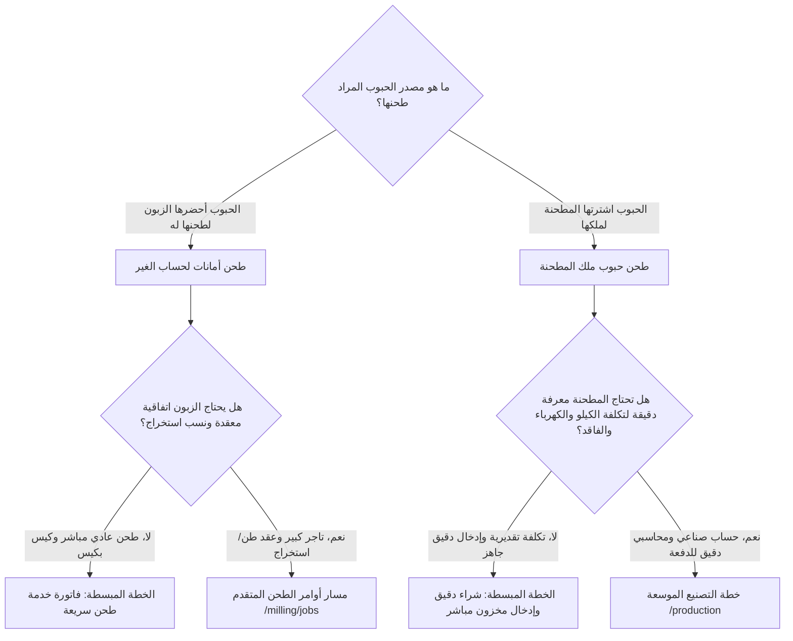

# دليل المقارنة والتوجيه بين خطتي تشغيل المطحنة (المبسطة vs التصنيعية)

> وثيقة توجيهية لصاحب العمل، مدير التشغيل، والمطورين — لتحديد متى وكيف يتم استخدام كل خطة في نظام Market-Hub / Vortex ERP
>
> **تاريخ التوثيق:** 2026-10-04  
> **الإصدار:** 1.0  
> **الملفات المرجعية التفصيلية:**
> - [وثيقة خطة العمل المبسطة](file:///c:/Users/mousa/Desktop/project/market-hup/docs/milling_simplified_workflow.md)
> - [وثيقة خطة الإنتاج والتصنيع الموسعة](file:///c:/Users/mousa/Desktop/project/market-hup/docs/milling_manufacturing_workflow.md)

---

## 1. ملخص تنفيذي

المطحنة كمنشأة أعمال تختلف عن المتجر العادي والمصنع النمطي؛ إذ تجمع بين **النشاط التجاري/الخدمي اليومي** (استقبال زبائن، أخذ حبوبهم، طحنها فوراً، وتحصيل أتعاب)، و**النشاط الصناعي التحويلي** (شراء أطنان من القمح الخام، طحنها على خطوط إنتاج، فرز الدقيق والنخالة، وتعبئتها لبيعها في السوق).

مشروع **Market-Hub / Vortex ERP** لا يفرض على المطحنة مساراً واحداً، بل يدعم **الخطين معاً بتناغم كامل وبدون أي تعارض**:

```
                                  مطحنة Market-Hub
                                         │
                 ┌───────────────────────┴───────────────────────┐
                 ▼                                               ▼
      الخطة المبسطة / التجارية                      خطة الإنتاج والتصنيع الموسعة
  (Simplified Milling Operations)               (Advanced Industrial Manufacturing)
 ─────────────────────────────────             ─────────────────────────────────────
 • لطحن أمانات العملاء السريعة                 • لتصنيع مخزون المطحنة الخاص
 • لبيع الدقيق الجاهز والأكياس                 • لتحويل القمح الخام إلى دقيق ونخالة
 • فواتير مبيعات وخدمات ومصروفات               • أوامر إنتاج، وصفات، تكاليف مشتركة
 • بدون تعقيد حسابات الإنتاج                   • حساب WIP وأستاذ عام وفواقد مسببة
 • الشاشات: POS, Invoices, Expenses            • الشاشات: Production, Milling Jobs
```

---

## 2. جدول المقارنة الشامل (Matrix Comparison)

| معيار المقارنة | الخطة المبسطة / التقليدية | خطة الإنتاج والتصنيع الموسعة |
|----------------|---------------------------|------------------------------|
| **الجمهور المستهدف** | مطاحن القرى، مطاحن التجزئة، مطاحن طحن أمانات الزبائن | مطاحن الدقيق الصناعية، المطاحن التي تطحن لحساب علامتها التجارية |
| **طبيعة النشاط** | خدمي وتجاري مباشر | تصنيعي وتحويلي متكامل |
| **ملكية المواد الخام (القمح)** | مملوكة للعميل (أمانات) أو شراء دقيق جاهز لإعادة بيعه | مملوكة للمطحنة ومخزنة في مستودعاتها وصوامعها |
| **مستند البداية** | إيصال استلام حبوب أو طلب مباشر من الكاشير | أمر إنتاج رسمي (`production_order`) مستند لوصفة (`BOM`) |
| **صرف المواد الخام** | غير مطلوب (أو صرف أكياس التعبئة فقط) | صرف فيزيائي من المستودع يخفض رصيد القمح بالتكلفة اللحظية |
| **تتبع فواقد الطحن** | تقديري أو يُهمل تشغيلياً | دقيق بالكيلوغرام ومسبب بقيد مالي مستقل في حساب `5911` |
| **حساب تكلفة الدقيق الناتج** | سعر شراء ثابت أو متوسط مرجح للمشتريات | تكلفة صناعية متغيرة = (قمح + أكياس + أجور مباشرة + مصاريف تشغيل) |
| **تقييم النواتج العرضية (النخالة)** | تباع كصنف مستقل دون نسب تكلفة | توزيع محاسبي معتمد: `NRV` أو `Relative Sales` أو `Remainder` |
| **المعالجة المحاسبية** | قيود فواتير مبيعات ومصروفات نقدية عادية | قيود تشغيل كاملة عبر حساب إنتاج تحت التشغيل `1312 WIP` |
| **إصدار الفاتورة** | فور إنهاء الطحن للعميل أو عند نقطة البيع | الفاتورة تصدر لاحقاً عند بيع الدقيق للجمهور وتجار الجملة |
| **الشاشات المستخدمة** | `/pos`, `/invoices`, `/expenses`, `/milling/delivery` | `/production`, `/milling/jobs`, `/milling/intake` |
| **مستوى المهارة المطلوب للمشغل** | موظف كاشير أو عامل تسليم عادي | مدير إنتاج، أمين مستودع، ومحاسب تكاليف |
| **السرعة الإجرائية** | سريعة جداً ولحظية | مرحلية ومحكمة وتتطلب إقفال ومراجعة أوزان |

---

## 3. مصفوفة اتخاذ القرار: متى تستخدم كل مسار؟



### الحالة الأولى: استخدام الخطة المبسطة
1. مزارع أو عميل أحضر 3 أكياس قمح لطحنها واستلامها في نفس اليوم.
2. المطحنة تشتري دقيقاً مطحوناً جاهزاً من مطاحن كبرى وتبيعه بالقطاعي للمستهلكين.
3. المطحنة تبيع نخالة، خيوط، أكياس فارغة، أو بهارات كنشاط تجاري موازٍ.
4. تسجيل المصروفات اليومية السريعة (ديزل مولد، غداء عمال، صيانة سيور) عبر سندات الصرف.

### الحالة الثانية: استخدام خطة التصنيع الموسعة
1. اشترت المطحنة 50 طن قمح صلب، وتريد تفريغه في الصوامع، ثم طحنه وتعبئته في أكياس 25 كجم و 50 كجم تحمل شعار المطحنة.
2. المطحنة تريد معرفة: "كم كلفنا كيس الدقيق بالضبط بعد إضافة استهلاك الديزل والكهرباء وأجور الوردية؟".
3. الرغبة في رقابة حازمة تمنع سرقة القمح أو الهدر غير المبرر بمقارنة الوزن الداخل بالخارج.
4. إعداد قوائم مالية وميزانية عمومية تتطلب إثبات حساب الإنتاج تحت التشغيل (`1312`) وتقييم المخزون وفق المعايير المحاسبية.

---

## 4. نموذج التشغيل الهجين (Hybrid Model) — الحل الأمثل للمطاحن

الواقع العملي في المطاحن الحديثة يجمع بين النموذجين:

```
┌────────────────────────────────────────────────────────────────────────┐
│                        تشغيل المطحنة الهجين                            │
├───────────────────────────────────┬────────────────────────────────────┤
│       قسم صالة الطحن الصناعي      │           قسم صالة الاستقبال       │
│      (Industrial Production)      │        (Front Desk & Retail)       │
├───────────────────────────────────┼────────────────────────────────────┤
│ • يشتغل بنظام: خطة التصنيع الموسعة│ • يشتغل بنظام: الخطة المبسطة       │
│ • الشاشة: /production             │ • الشاشة: /pos و /invoices         │
│ • يستهلك القمح الخام ويفرز الدقيق  │ • يستقبل طلبات الزبائن والمزارعين  │
│ • يحسب التكلفة ويرحل للأستاذ العام│ • يسلم الدقيق الجاهز فوراً         │
│ • يغذي المستودع بآلاف الأكياس     │ • يقبض الأموال ويسجل فواتير البيع  │
└───────────────────────────────────┴────────────────────────────────────┘
```

بهذا التكامل، لا يشعر الكاشير أو رجل المبيعات بتعقيدات التصنيع والسلندرات، وفي نفس الوقت لا يفقد المحاسب ومدير المصنع الرقابة الحازمة على أطنان القمح والمصروفات والأصول.

---

## 5. الخلاصة والتوجيه

1. **كلا النظامين متوفران ويعملان في قاعدة الكود الحالية.**
2. **لا تقم بإلغاء أي منهما لصالح الآخر.**
3. راجع التفاصيل الكاملة في الوثيقتين المرفقتين:
   - [docs/milling_simplified_workflow.md](file:///c:/Users/mousa/Desktop/project/market-hup/docs/milling_simplified_workflow.md)
   - [docs/milling_manufacturing_workflow.md](file:///c:/Users/mousa/Desktop/project/market-hup/docs/milling_manufacturing_workflow.md)
